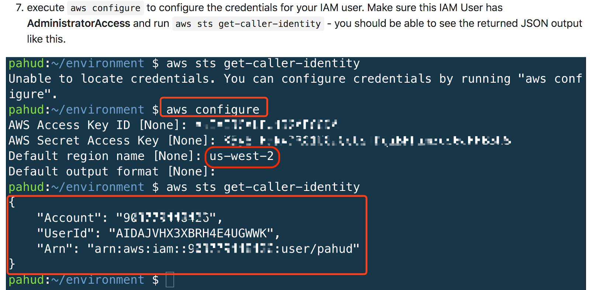
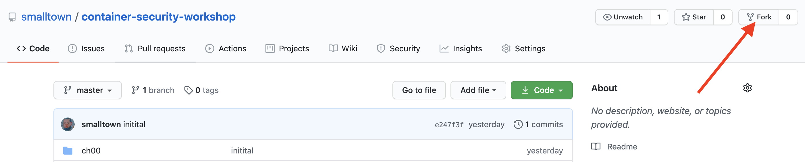

name: CH00 Workshop Environment Setup
class: title

# CH00 Workshop Environment Setup
## All Things are Difficult Before They are Easy

---
name: Choose Region

# Choose Region

.center[]

---
name: Setup Cloud9
# Setup Cloud9

.center[]

## Following pictures of installation guide comes from: 
## https://github.com/pahud/amazon-eks-workshop

---
name: Create Environment

# Create Environment

.center[]

---
name: New Environment

# New Environment

.center[]

---
name: Choose Platform

.center[]

---
name: Environment Initialized

.center[]

---
name: Disable Temporary Credentials

.center[]

---
name: Check Temporary Credentials Unexist

.center[]

---
name: Configure AWS AK/SK

.center[]

---
name: Create IAM Key if You Have No One (1/4)

# Create IAM Key if You Have No One (1/4)

.center[]

---
name: Create IAM Key if You Have No One (2/4)

# Create IAM Key if You Have No One (2/4)

.center[]

---
name: Create IAM Key if You Have No One (3/4)

# Create IAM Key if You Have No One (3/4)

.center[]

---
name: Create IAM Key if You Have No One (4/4)

# Create IAM Key if You Have No One (4/4)

.center[]

---
name: Generate Git SSH Key for GitHub Operation

# Generate Git SSH Key for GitHub Operation

```shell
# Enter, Enter, Enter
ssh-keygen -t rsa -b 4096

cp ~/.ssh/id_rsa.pub ~/environment/

# Add GitHub SSH Key by Below SSH Public Key
cat ~/environment/id_rsa.pub
...
ssh-rsa AAAAB3NzaC1yc2EAAAADAQABAAACAQCveKbDQPFNMPNLsCzdTDvpjyT27Pt/MXsMa3BkzHc/69brQHc15Jjooc/LKj9PjUAUwoBtuE7glLRph3qSltbg+he/vrZ6gZT6BoXDpQVdLCXSXdA0OaZae6HmkoXnPCvG4ujNmwbctQBLrhLX5IZaNQWeOgXuw5B68Zy549uyEXO0tsqmaPMjZXXe1xHhkd9yFEdo63apEmPpZYW/jsvkN+1XzYBjymucTF//qnbHe0lEV3DkDteYq4h/kUoQJZHPWsWXkgaX6FaaB51eMX8VkifThArXI+RJfB+0FTaN7PbZuRJmWMtQPJ16yQ5yFW3C527DAYjBrFis+b5tfLduii6DDz3KBKmNITUUzdx/29PD/E0A6OsvBcVe12TPfEeNKsNOEeINSeZixiMT0DHS5cwTEGdvrZQWIbXU3l50tDG5WiObWPOA82enPL/ApCgm66LwhSsPfRd8awjbCV+19DwVPutObTuvrBq2Ockm5QIrZcIXP8PYHM9iriM6xnRS9FG8qeB8QyJhBfX3MpIYdqtjodeWtcGxImqrphK6tJHLI92pbs0qmrcY4VEmK65rfG6w4u4PGlQjC5uUPL0FuNh96CJX2OaxGFWM6md7TRUnmPA5PFFvBHc8EkHm7u6E3UkFioA83s51vooMmTyH7fi/FcWFjwuevevzZ5CFQQ== ubuntu@ip-172-31-34-212
```

---
name: Add GitHub SSH Key

# Add GitHub SSH Key

.center[]

---
name: Fork https://github.com/smalltown/container-security-workshop

# Fork https://github.com/smalltown/container-security-workshop

.center[]

---
name: Provision Environment

# Provision Environment

```shell
# (~/environment)
git clone git@github.com:{YOUR_NAME}/container-security-workshop.git
cd container-security-workshop

# (~/environment/container-security-workshop)
cd ch00

# (~/environment/container-security-workshop/ch00)
./setup.sh

... (15~20 minutes later)
NAME                 TYPE        CLUSTER-IP   EXTERNAL-IP   PORT(S)   AGE
service/kubernetes   ClusterIP   10.100.0.1   <none>        443/TCP   7m
Done setting EKS.
```

---
name: Tear Down Environment Before Leaving

# Tear Down Environment Before Leaving

```shell
*# 下課前記得要把雲端資源刪光光 (可是...不是現在執行!)
*# 下課前記得要把雲端資源刪光光 (可是...不是現在執行!)
*# 下課前記得要把雲端資源刪光光 (可是...不是現在執行!)

# (~/environment/container-security-workshop/ch00)
./teardown.sh

# (~/environment/container-security-workshop/ch03/irsa/terraform)
terraform destroy -auto-approve

*# 執行完務必要到 AWS Console 檢查刪光光了沒
*# 執行完務必要到 AWS Console 檢查刪光光了沒
*# 執行完務必要到 AWS Console 檢查刪光光了沒
```
