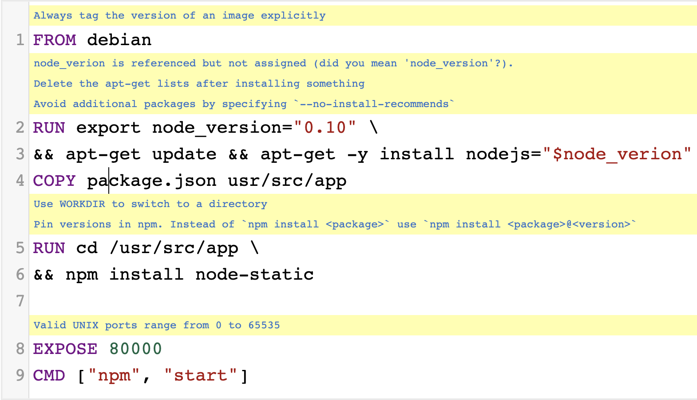
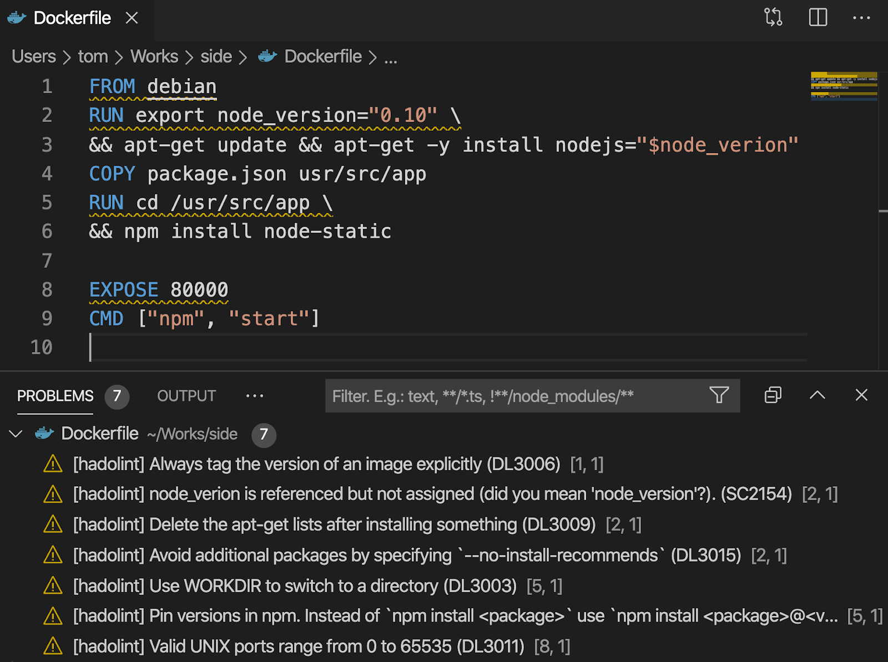
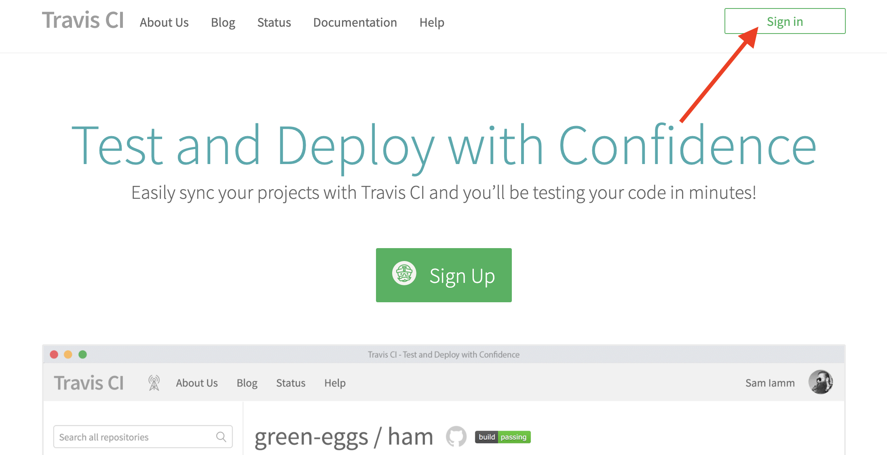
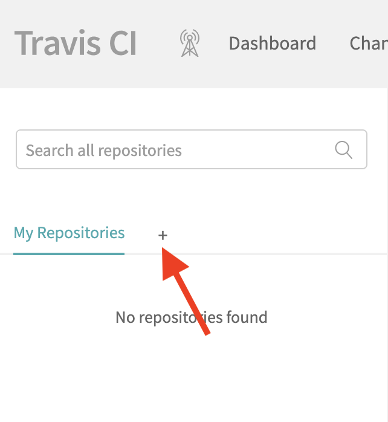
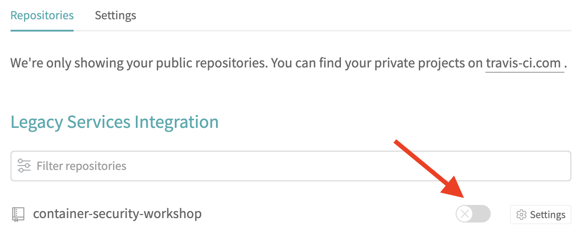
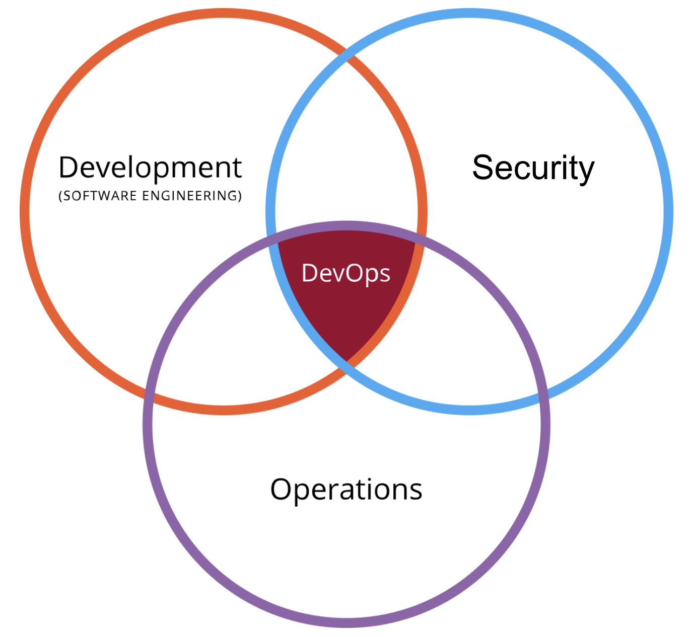

name: CH01 Container Image Building
class: title

#  CH01 Container Image Building
## The Devil is Hiding in the Details

---
name: Container Image Build Practices (1/2)
# Container Image Build Practices (1/2)

## - Minimal Base Images
## - Least Privileged User
## - Use Fixed Tags
## - Sign/Verify Images ([Docker Notary](https://docs.docker.com/notary/getting_started/))
## - Don’t Contain Sensitive Information

---
name: Container Image Build Practices (2/2)
# Container Image Build Practices (2/2)

## - Use COPY Instead of ADD
## - Use Metadata Labels
## - Multi-Stage Build Small/Secure Images
## - **Use Linter**
## - **Find/Fix/Monitor Vulnerabilities**

---
name:  Use Dockerfile Linter: Hadolint

# Use Dockerfile Linter: Hadolint

.center[]

---
name: Hadolint Rules

# [Hadolint Rules](https://github.com/hadolint/hadolint#rules)

.center[]

---
name: When to Use Hadolint? (1/3)

# When to Use Hadolint? (1/3)
## Hadolint CLI Tool

```shell
~$ hadolint Dockerfile

Dockerfile:1 DL3006 Always tag the version of an image explicitly
Dockerfile:2 SC2154 node_verion is referenced but not assigned (did you mean 'node_version'?).
Dockerfile:2 DL3009 Delete the apt-get lists after installing something
Dockerfile:2 DL3015 Avoid additional packages by specifying `--no-install-recommends`
Dockerfile:5 DL3003 Use WORKDIR to switch to a directory
...
```

---
name: When to Use Hadolint? (2/3)

# When to Use Hadolint? (2/3)
## Development IDE


.center[]

---
name: When to Use Hadolint? (3/3)

# When to Use Hadolint? (3/3)
## Of Course, CI/CD Pipeline


.center[]

---
name: Visit Travis CI

# Visit [Travis CI](https://travis-ci.org/)

.center[]

---
name: Sign in With GitHub

# Sign in With GitHub

.center[]

---
name: Authorize travis-ci

.center[]

---
name: Add Repository into Travis CI (1/2)

# Add Repository into Travis CI (1/2)

.center[]

---
name: Add Repository into Travis CI (2/2)

# Add Repository into Travis CI (2/2)

.center[]

---
name: Check Added Repository

# Check Added Repository

.center[]

---
name: Modify Dockerfile

# Modify Dockerfile

```dockerfile
# (~/environment/container-security-workshop/ch01/Dockerfile)

FROM composer:1.7.2

COPY ./ch01/composer_laravel.lock /php-app/composer.lock
COPY ./ch01/Gemfile_rails.lock /ruby-app/Gemfile.lock
COPY ./ch01/package-lock_react.json /node-app/package-lock.json
COPY ./ch01/Pipfile.lock /python-app/Pipfile.lock
COPY ./ch01/Cargo.lock /rust-app/Cargo.lock

*EXPOSE 80000
```

---
name: Push Change to GitHub

# Push Change to GitHub

```shell
# (~/environment/container-security-workshop/ch01)

git config --global user.name "#{YOUR_NAME}"
git config --global user.email "#{YOUR_EMAIL}"
git add .
git commit -m "lint fail case"
git push origin master
```

---
name: CI/CD Job Log

# CI/CD Job Log

.center[]

---
name: Modify Dockerfile

# Modify Dockerfile

```dockerfile
# (~/environment/container-security-workshop/ch01/Dockerfile)

FROM composer:1.7.2

COPY ./ch01/composer_laravel.lock /php-app/composer.lock
COPY ./ch01/Gemfile_rails.lock /ruby-app/Gemfile.lock
COPY ./ch01/package-lock_react.json /node-app/package-lock.json
COPY ./ch01/Pipfile.lock /python-app/Pipfile.lock
COPY ./ch01/Cargo.lock /rust-app/Cargo.lock

*#EXPOSE 80000
```

---
name: Push Change to GitHub

# Push Change to GitHub

```shell
# (~/environment/container-security-workshop/ch01)

git add .
git commit -m "lint success case"
git push origin master
```

---
name: CI/CD Job Log

# CI/CD Job Log

.center[]

---
name: How to Find Vulnerabilities? 

# How to Find Vulnerabilities? 

## - Of Course! Scanning!
## - Commercial V.S. Open Source
## - Open Source: Anchor, Clair, [**Trivy**](https://github.com/aquasecurity/trivy)...

---
name: Scan Coverage

# Scan Coverage

## - OS Packages: 
   - Alpine, Red Hat Universal Base Image, Red Hat Enterprise Linux, CentOS, Debian and Ubuntu

## - Application Dependencies
  - Bundler, Composer, Pipenv, Poetry, npm, yarn and Cargo

---
name: When to Scan?

# When to Scan?

## Of Course, Integrate CI/CD Pipeline to Achieve **DevSecOps**

.center[]

---
name: DevOps

# DevOps

.center[]

---
name: DevSecOps

# DevSecOps

.center[]

---
name: The Element of DevSecOps

# The Element of DevSecOps

.center[]

---
name: How to Achieve DevSecOps?

# How to Achieve DevSecOps?

## - Security Gene in Development
## - Secret Management
## - Infrastructure ~~As~~ Must Be Code 
## - System Management

---
name: Modify .travis.yml

# Modify .travis.yml

```shell
# (~/environment/container-security-workshop/.travis.yml)

# scan container image need to workaround for issue (https://github.com/aquasecurity/trivy/issues/198)
- docker images
- docker save container-security:${COMMIT} -o container-security-${COMMIT}.tar
*- trivy --exit-code 0 --severity HIGH --no-progress --input container-security-${COMMIT}.tar
*- trivy --exit-code 1 --severity CRITICAL --no-progress --input container-security-${COMMIT}.tar
```

---
name: Push Change to GitHub

# Push Change to GitHub

```shell
# (~/environment/container-security-workshop)

git add .
git commit -m "scan container image"
git push origin master
```

---
name: CI/CD Job Log

# CI/CD Job Log

.center[]

---
name: Key Takeaways

# Key Takeaways

## - Container Image Build Practices
## - DevSecOps Concept
## - Lint and  Scan Container Image within CI/CD Pipeline
