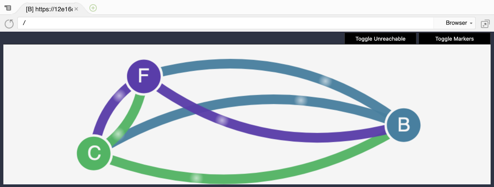

name: CH02 Kubernetes Basic Security I
class: title

#  CH02 Kubernetes Basic Security I
## With Only a Smattering of K8S

---
name: Network Policy
class: title

# Network Policy
## **Network Misconfigurations** Are Major Source Of Reliability and Security Issues

---
name: Connection Between Pods/Endpoints

# Connection Between Pods/Endpoints

.center[]

---
name: What is The Problem?

# What is The Problem?

## By Default, Pods are **Non-Isolated**; They Accept Traffic from any Source.

.center[]

---
name: Kubernetes Network Policy

# Kubernetes Network Policy

.center[]

---
name: How to Enable Network Policy?

# How to Enable Network Policy?

.center[]

---
name: Does AWS EKS Support Network Policy ?

# Does AWS EKS Support Network Policy ?

## - **No**, AWS VPC CNI Doesn’t Support Network Policy

## - So We Can Leave Early Today?

---
name: Install Calico on AWS EKS

# Install Calico on AWS EKS

```shell
# (~/environment/container-security-workshop/ch02/network-policy)

. ~/.bashrc
kubens kube-system
kubectl apply -f manifests/calico.yaml
kubectl get daemonset calico-node

NAME          DESIRED   CURRENT   READY   UP-TO-DATE   AVAILABLE   NODE SELECTOR                 AGE
calico-node   2         2         2       2            2           beta.kubernetes.io/os=linux   80s
```

---
name: Testing Scenario

# Testing Scenario

.center[]

---
name: Deploy Testing Environment

#  Deploy Testing Environment

```shell
# (~/environment/container-security-workshop/ch02/network-policy)

kubectl apply -f manifests/namespace.yaml
kubectl apply -f manifests/management-ui.yaml
kubectl apply -f manifests/backend.yaml
kubectl apply -f manifests/frontend.yaml
kubectl apply -f manifests/client.yaml
kubectl get pods --all-namespaces --watch
...
*# Wait for all the pods are Running then click Ctrl+c
...
kubectl port-forward service/management-ui -n management-ui 8080:9001
```

---
name: Verify Testing Environment

# Verify Testing Environment

.center[]

.center[]

---
name: Default Deny Network Policy

# Default Deny Network Policy

```shell
*# Another Terminal
# (~/environment/container-security-workshop/ch02/network-policy)

kubectl apply -n stars -f ./policies/default-deny.yaml
kubectl apply -n client -f ./policies/default-deny.yaml
*# Click Refresh Botton
```

.center[]

---
name: What Happened?!

# What Happened?!

```yaml
# (ch02/network-policy/policies/default-deny.yaml)

kind: NetworkPolicy
apiVersion: networking.k8s.io/v1
metadata:
  name: default-deny
spec:
  podSelector:
    matchLabels: {}
```

---
name: Allow Management UI Access Services

# Allow Management UI Access Services

```shell
# (~/environment/container-security-workshop/ch02/network-policy)

kubectl apply -f ./policies/allow-ui.yaml
kubectl apply -f ./policies/allow-ui-client.yaml
*# Click Refresh Botton
```

.center[]

---
name: What Happened?!

# What Happened?!

```yaml
# (ch02/network-policy/policies/allow-ui.yaml)

...
metadata:
  namespace: stars
  name: allow-ui
spec:
*  podSelector:
*    matchLabels: {}
*  ingress:
*    - from:
*        - namespaceSelector:
*            matchLabels:
*              role: management-ui
```

---
name: Allow Frontend Service to Backend Service

# Allow Frontend Service to Backend Service

```shell
# (~/environment/container-security-workshop/ch02/network-policy)

kubectl apply -f ./policies/backend-policy.yaml
*# Click Refresh Botton
```

.center[]

---
name: What Happened?!

# What Happened?!

```yaml
# (ch02/network-policy/policies/backend-policy.yaml)

...
spec:
*  podSelector:
*    matchLabels:
*      role: backend
*  ingress:
*    - from:
*        - podSelector:
*            matchLabels:
*              role: frontend
*      ports:
*        - protocol: TCP
*          port: 6379
```

---
name: Allow Client to Frontend Service

# Allow Client to Frontend Service

```shell
# (~/environment/container-security-workshop/ch02/network-policy)

kubectl apply -f ./policies/frontend-policy.yaml
*# Click Refresh Botton
```

.center[]

---
name: What Happened

# What Happened

```yaml
# (ch02/network-policy/policies/front-policy.yaml)

...
spec:
*  podSelector:
*    matchLabels:
*      role: frontend 
*  ingress:
*    - from:
*        - namespaceSelector:
*            matchLabels:
*              role: client
*      ports:
*        - protocol: TCP
*          port: 80
```

---
name: RBAC
class: title

# RBAC
## Principle of Least Privilege

---
name: Kubernetes RBAC Authorization

# Kubernetes [RBAC](https://en.wikipedia.org/wiki/Role-based_access_control) Authorization

.center[]

---
name: Kubernetes Default Role/ClusterRole

# Kubernetes Default Role/ClusterRole

```shell
# (~/environment/container-security-workshop/ch02/rbac)

kubens kube-system
kubectl get role
kubectl get clusterrole
...
admin                                                         2d14h
aws-node                                                      2d14h
cluster-admin                                                 2d14h
...
```

---
name: Check the view ClusterRole

# Check the view ClusterRole

```shell
# (~/environment/container-security-workshop/ch02/rbac)

kubectl describe clusterrole view
...
Name:         view
Labels:       kubernetes.io/bootstrapping=rbac-defaults
              rbac.authorization.k8s.io/aggregate-to-edit=true
Annotations:  rbac.authorization.kubernetes.io/autoupdate: true
PolicyRule:
  Resources        Non-Resource URLs  Resource Names  Verbs
  ---------        -----------------  --------------  -----
  bindings         []                 []              [get list watch]
  configmaps       []                 []              [get list watch]
  endpoints        []                 []              [get list watch]
...
``` 

---
name: Everyone is Administrator in Your Organization?!

# Everyone is Administrator in Your Organization?!

.center[]

---
name: Principle of Least Privilege

# Principle of Least Privilege

## Let’s Demonstrate a Example to Separate Developer and Administrator User 

.center[]

---
name: Check Administrator Permission

# Check Administrator Permission

```yaml
# (~/environment/container-security-workshop/ch02/rbac/manifests/rbac-admin.yaml)
…
rules:
 - apiGroups: ["*"]
   resources: ["pods"]
   verbs: ["list","get","watch", "delete"]
 - apiGroups: ["extensions","apps"]
   resources: ["deployments"]
   verbs: ["get","list","watch","create","update","patch","delete"]
...
```

---
name: Check Developer Permission

# Check Developer Permission

```yaml
# (~/environment/container-security-workshop/ch02/rbac/manifests/rbac-dev.yaml)
…
rules:
 - apiGroups: ["*"]
   resources: ["pods"]
   verbs: ["list"]
...
```

---
name: Create Kubernetes Resource

# Create Kubernetes Resource

```shell
# (~/environment/container-security-workshop/ch02/rbac/)

kubectl create -f manifests/namespace.yaml
kubens rbac
kubectl create -f manifests/rbac-admin.yaml 
kubectl create -f manifests/rbac-dev.yaml
kubectl create -f manifests/nginx.yaml
kubectl create -f manifests/admin.yaml
kubectl create -f manifests/dev.yaml
```

---
name: Developer Get Pods

# Developer Get Pods

```shell
# (~/environment/container-security-workshop/ch02/rbac/)

kubectl exec -it $(kubectl get pods --selector "app=dev" -o jsonpath="{.items[0].metadata.name}") kubectl get pod
...
NAME                     READY   STATUS    RESTARTS   AGE
admin-5b8b5546cc-wfvfx   1/1     Running   0          17m
dev-786fdcdbcc-nwkbb     1/1     Running   0          23m
nginx-6d767db9cf-fq9hx   1/1     Running   0          14m
```

---
name: Developer Delete Deployment

# Developer Delete Deployment

```shell
# (~/environment/container-security-workshop/ch02/rbac/)

kubectl exec -it $(kubectl get pods --selector "app=dev" -o jsonpath="{.items[0].metadata.name}") kubectl delete deployment nginx
...
Error from server (Forbidden): deployments.extensions "nginx" is forbidden: User "system:serviceaccount:rbac:rbac-dev" cannot delete resource "deployments" in API group "extensions" in the namespace "rbac"
command terminated with exit code 1
```

---
name: Administrator Delete Deployment

# Administrator Delete Deployment

```shell
# (~/environment/container-security-workshop/ch02/rbac/)

kubectl exec -it $(kubectl get pods --selector "app=admin" -o jsonpath="{.items[0].metadata.name}") kubectl delete deployment nginx
...
deployment.extensions "nginx" deleted
```

---
name: Key Takeaways

# Key Takeaways

## - How Network Policy Take Effect
## - Use RBAC to Achieve Principle of Least Privilege within Kubernetes Cluster