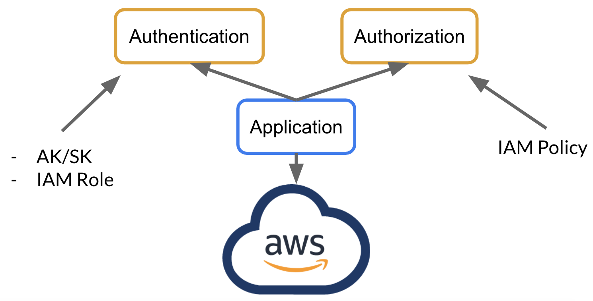
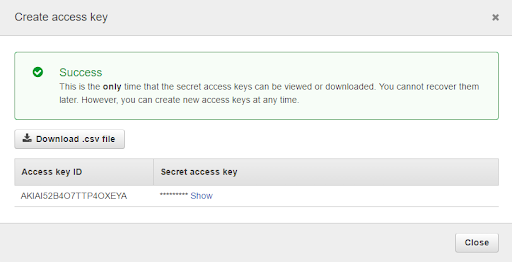
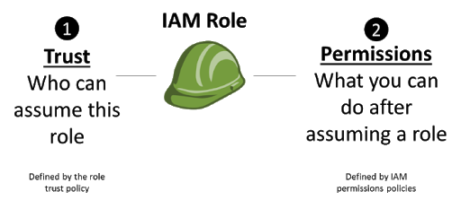
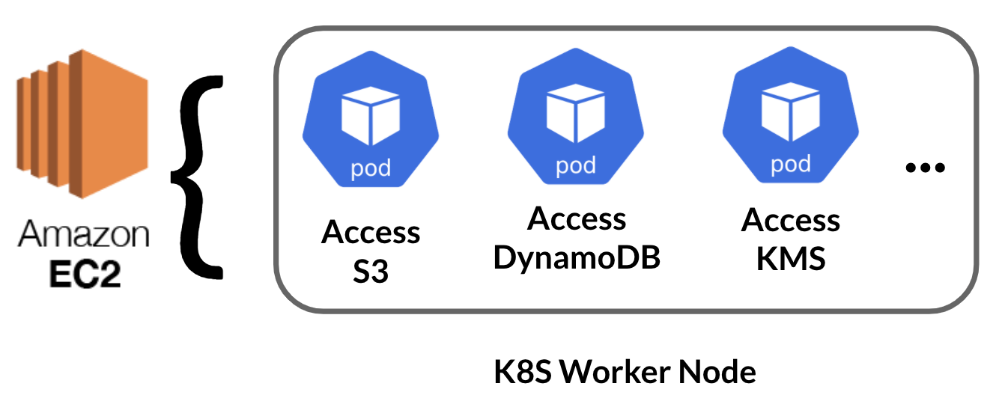
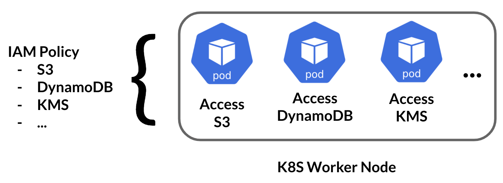
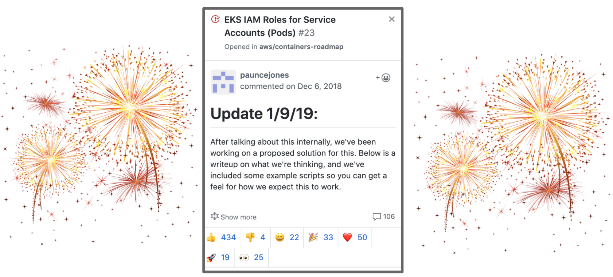
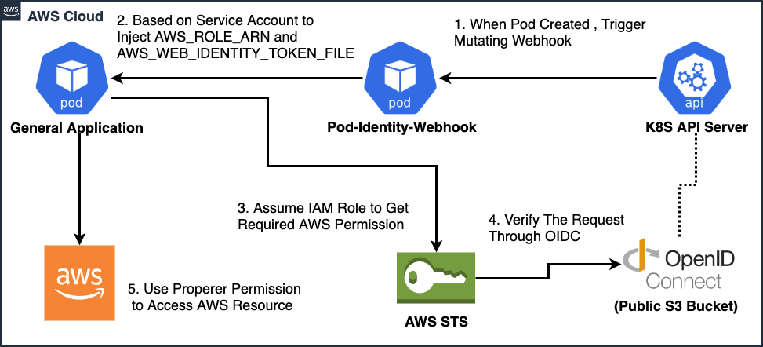
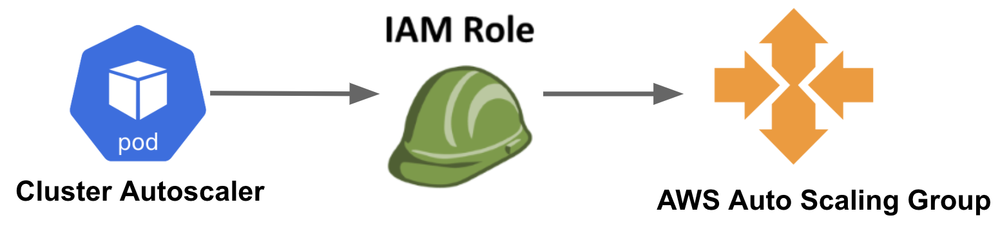
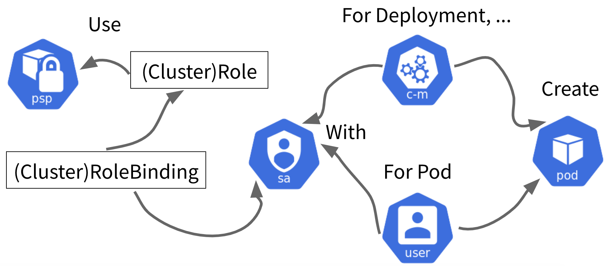

name: CH03 Kubernetes Basic Security II
class: title

#  CH03 Kubernetes Basic Security II
## With Only a Smattering of Kubernetes

---
name: IRSA
class: title

# IRSA
## Don't Put All Your Eggs in One Basket

---
name: How Application Access Cloud Resource

# How Application Access Cloud Resource

.center[]

---
name: Access Key ID/Secret Access Key

# Access Key ID/Secret Access Key

.center[]

---
name: IAM Role

# IAM Role

.center[]

---
name: Which one is Better?

# Which one is Better?

## - It Depends…
## - Inside AWS
## - Outside AWS

---
name: K8S Use IAM Role Before...

# K8S Use IAM Role Before...

.center[]

---
name: K8S Use IAM Role Before...

# K8S Use IAM Role Before...

.center[]

---
name: One Year Later...

# One Year Later...

.center[]

---
name: IAM Role for Service Account

# IAM Role for Service Account

.center[]


---
name: Learning by Doing

# Learning by Doing

.center[]

---
name: Create Cloud Resource by Terraform

# Create Cloud Resource by Terraform

```shell
# (~/environment/container-security-workshop/ch03/irsa/terraform)

terraform init
terraform apply -auto-approve
...
Apply complete! Resources: 2 added, 1 changed, 2 destroyed.
Outputs:
aws_account_id = 123456789
```

---
name: Install Cluster Autoscaler 

# Install Cluster Autoscaler 

```shell
# (~/environment/container-security-workshop/ch03/irsa/terraform)

helm repo add stable https://kubernetes-charts.storage.googleapis.com

helm install cluster-autoscaler --namespace kube-system stable/cluster-autoscaler --values=cluster-autoscaler-chart-values.yaml
```

---
name: Verify Cluster Autoscaler

# Verify Cluster Autoscaler

```shell
# (~/environment/container-security-workshop/ch03/irsa/terraform)

kubectl --namespace=kube-system get pods -l "app.kubernetes.io/name=aws-cluster-autoscaler"
...
NAME                                                                                                        READY   STATUS    RESTARTS   AGE
cluster-autoscaler-aws-cluster-autoscaler-f59bcb45d-nkqrx   1/1             Running  0                   14s
...

kubectl --namespace=kube-system get pods -l "app.kubernetes.io/name=aws-cluster-autoscaler" -o yaml | grep -A3 AWS_ROLE_ARN
...
 *- name: AWS_ROLE_ARN
 *   value: arn:aws:iam::123456789:role/cluster-autoscaler-tom
 *- name: AWS_WEB_IDENTITY_TOKEN_FILE
 *   value: /var/run/secrets/eks.amazonaws.com/serviceaccount/token

kubectl --namespace=kube-system logs -l "app.kubernetes.io/name=aws-cluster-autoscaler"
```

---
name: PSP
class: title

# PSP
## Prevention is Better than Cure

---
name: Pod Security Policies

# Kubernetes Pod Security Policies

## - Define a Set of Conditions that a Pod Must Run With in Order to be Accepted Into the System

  - Usage of volume types
  - Usage of host networking and ports
  - The user and group IDs of the container
  - [...](https://kubernetes.io/docs/concepts/policy/pod-security-policy/)

---
name: How to Use PSP

# How to Use PSP

.center[]

---
name: When a Pod Created... 

# When a Pod Created... 

## - The PSP is Enabled, Pod Don’t Use the PSP -> Fail
## - The PSP is Enabled, Pod Can Use the PSP, Pod Don’t Follow PSP -> Fail
## - The PSP is Enabled, Pod Can Use the PSP, Pod Follow PSP -> Success


---
name: How to Enable PSP

# How to Enable PSP

## - PSP API (policy/v1beta1/podsecuritypolicy) is Enabled Independently of the Admission Controller
## - Existing Clusters is Recommended that Policies are Added and Authorized before Enabling PSP

---
name: Check EKS Default PSP

# Check EKS Default PSP

```shell
kubectl get psp eks.privileged
...
NAME             PRIV   CAPS   SELINUX    RUNASUSER   FSGROUP    SUPGROUP   READONLYROOTFS   VOLUMES
eks.privileged   true   *      RunAsAny   RunAsAny    RunAsAny   RunAsAny   false            *

kubectl describe psp eks.privileged
...
```

---
name: Practice PSP Right Now?

# Practice PSP Right Now?

## - PSP Only Manage K8S Pod, But There are so Many Other Resources in K8S Cluster
## - Hence, There is Another Auditing Mechanism being Introduced in this Workshop

---
name: Key Takeaways

# Key Takeaways

## - Use IRSA Principle of Least Privilege within Cloud Provider
## - How PSP Protect your Kubernetes by Predefined Security Policy