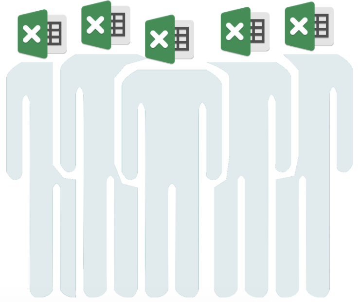

name: Policy as Code
class: title

# Policy as Code
## Prevention is Better than Cure

---
name: How to Auditing Kubernetes

# How to Auditing Kubernetes

## - Resource Request/Limit Setting
## - Only Grant Specific Container Registry
## - Cannot Mount Certain Host Volume
## - Ingress Rule
## - ...

---
name: Auditing Periodically ?!
class: img-right-full



# Auditing Periodically ?!

## - Lots of Spreadsheets
## - Lots of Manual Process
## - Takes Weeks to Months to Complete Review and Fix
## - Policy Document Not Ready Yet
## - But The Most Terrible ...

---
name: Shift Left Testing
class: img-caption

# Shift Left Testing - Testing is Performed Earlier in the Life Cycle


---
name: Development Life Cycle

# Development Life Cycle

.center[]

---
name: Development Life Cycle

# Development Life Cycle

.center[]

---
name: Development Life Cycle

# Development Life Cycle

.center[]

---
name: How to Achieve Automation Auditing?

# How to Achieve Automation Auditing?

.center[]

---
name: What is Policy?

# What is Policy?

## - Compliance Policies:  Ensure Compliance with External Standards (PCI-DSS, SOC, or GDPR)
## - Security Policies: Adopted Internally Protect Data Privacy and Infrastructure Integrity
## - Operational Excellence: Prevent Service Outages or Degradation

---
name: Some Policy as Code Tools

# Some Policy as Code Tools

## - ModSecurity: Only Focus on Web Application Firewall (Capital One Event)
## - Sentinel: Only Support Terraform, Vault, Nomad and Consul Enterprise (HashiCorp)
## - Inspec: High-Quality Shared Content, Only For Programmer (Chef)
## - Open Policy Agent: Solve Different Problems, Limited Shared Content

---
name: PaC Adopt Status

.center[]

---
name: What is Open Policy Agent?

# What is Open Policy Agent?

.center[]

---
name: OPA Features

# OPA Features

## - Declarative Policy Language (Rego)
## - Library, Sidecar, Host-Level Daemo
## - Management API for Control & Observability
## - Tooling to Build, Test and Debug Policy

---
name: OPA Integrations

# OPA Integrations

.center[]

---
name: How Does OPA Work?

class: img-right


# How Does OPA Work?

## - Example Policy: Employees Can Read Their Own Salary And The Salary of Anyone They Manage

---
name: Get Self Salary Information (1/3)

# Get Self Salary Information (1/3)

```json
# (~/environment/container-security-workshop/ch04/http/inputs/self-read.json)

{
  "path": ["finance", "salary", "alice"],
  "user": "alice",
  "method": "GET",
  "user_agent": "cURL/1.0",
  "remote_addr": "127.0.0.1"
}
```

---
name: Get Self Salary Information (2/3)

# Get Self Salary Information (2/3)

```json
# (~/environment/container-security-workshop/ch04/http)

opa eval --data finance.rego --input ./inputs/self-read.json data.httpapi.authz

...
{
  "result": [
...
            "allow": true,
...
```

---
name: Get Self Salary Information (3/3)

# Get Self Salary Information (3/3)

```json
# (~/environment/container-security-workshop/ch04/http/finance.rego)
...
allow = true {
  http_api.method = "GET"
  http_api.path = ["finance", "salary", username]
  username = http_api.user
}
...
```

---
name: Get Subordinates Salary Information (1/3)

# Get Subordinates Salary Information (1/3)

```json
#(~/environment/container-security-workshop/ch04/http/inputs/manager-read.json)

{
  "path": ["finance", "salary", "alice"],
  "user": "bob",
  "method": "GET",
  "user_agent": "cURL/1.0",
  "remote_addr": "127.0.0.1"
}
```

---
name: Get Subordinates Salary Information (2/3)

# Get Subordinates Salary Information (2/3)

```json
# (~/environment/container-security-workshop/ch04/http)

opa eval --data finance.rego --input ./inputs/manager-read.json data.httpapi.authz

...{
  "result": [
...
            "allow": true,
...
```

---
name: Get Subordinates Salary Information (3/3)

# Get Subordinates Salary Information (3/3)

```json
# (~/environment/container-security-workshop/ch04/http/finance.rego)

subordinates = {"alice": [], "charlie": [], "bob": ["alice"], "betty": ["charlie"]}
...
allow = true {
  http_api.method = "GET"
  http_api.path = ["finance", "salary", username]
  subordinates[http_api.user][_] = username
}
...
```

---
name: Get Others Salary Information (1/2)

# Get Others Salary Information (1/2)

```json
# (~/environment/container-security-workshop/ch04/http/inputs/others-read.json)

{
  "path": ["finance", "salary", "alice"],
  "user": "charlie",
  "method": "GET",
  "user_agent": "cURL/1.0",
  "remote_addr": "127.0.0.1"
}
```

---
name: Get Others Salary Information (2/2)

# Get Others Salary Information (2/2)

```json
# (~/environment/container-security-workshop/ch04/http)

opa eval --data finance.rego --input ./inputs/others-read.json data.httpapi.authz

...{
  "result": [
...
            "allow": false,
...
```

---
name: How to Auditing Kubernetes

# How to Auditing Kubernetes

## - Resource Request/Limit Setting
## - Only Grant Specific Container Registry
## - Cannot Mount Certain Host Volume
## - Ingress Rule
## - ...

---
name: How OPA Audit K8S

# How OPA Audit K8S

.center[]

---
name: Create/Register OPA as K8S Admission Controller

# Create/Register OPA as K8S Admission Controller

```shell
# (~/environment/container-security-workshop/ch04/kubernetes)

./setup.sh
kubectl get pod
...
NAME                   READY   STATUS    RESTARTS   AGE
opa-5457459d4d-8jc8v   2/2     Running   0          25m
```

---
name: manifests/admission-controller.yaml

# manifests/admission-controller.yaml

```yaml
…
- name: kube-mgmt
  image: openpolicyagent/kube-mgmt:0.8
  args: 
      - "--replicate=v1/pods"
      - "--replicate=apps/v1/deployments"
...

```

---
name: Create Nginx With/Without Resource Request/Limit (1/3)

# Create Nginx With/Without Resource Request/Limit (1/3)

```shell
#(~/environment/container-security-workshop/ch04/kubernetes)

kubens default
kubectl create -f manifests/nginx-resource-management.yaml
kubectl create -f manifests/nginx-no-resource-management.yaml
```

---
name: Create Nginx With/Without Resource Request/Limit (2/3)

# Create Nginx With/Without Resource Request/Limit (2/3)

```shell
# (~/environment/container-security-workshop/ch04/kubernetes)

kubectl get deployment
...
NAME                                READY   UP-TO-DATE   AVAILABLE   AGE
nginx-with-resource-management      1/1     1            1           46m
nginx-without-resource-management   0/1     0            0           30m
```

---
name: Create Nginx With/Without Resource Request/Limit (3/3)

# Create Nginx With/Without Resource Request/Limit (3/3)

```shell
# (~/environment/container-security-workshop/ch04/kubernetes)

kubectl get pod
...
NAME                                             READY   STATUS    RESTARTS   AGE
nginx-with-resource-management-7fd9dbb4f-mzsmf   1/1     Running   0          48m
```

---
name: Add Policy to Block Image Not docker.io (1/4)

# Add Policy to Block Image Not docker.io (1/4)

```json
# (~/environment/container-security-workshop/ch04/kubernetes/policies/basic-auditing.rego)

deny[msg] {
  input.request.kind.kind == "Pod"
  operations[input.request.operation]
  containers := pod_containers(input.request.object)
  image := containers[_].image
  not startswith(image, "docker.io")
  msg := "image not align with organization compliance"
}
```

---
name: Add Policy to Block Docker Not docker.io (2/4)

# Add Policy to Block Docker Not docker.io (2/4)

```shell
# (~/environment/container-security-workshop/ch04/kubernetes)

kubectl delete -n opa cm basic-auditing
kubectl create configmap -n opa basic-auditing --from-file=policies/basic-auditing.rego
kubectl create -f manifests/nginx-not-official-image.yaml
```

---
name: Add Policy to Block Docker Not docker.io (3/4)

# Add Policy to Block Docker Not docker.io (3/4)

```shell
# (~/environment/container-security-workshop/ch04/kubernetes)

kubectl get deployment
...
NAME                                READY   UP-TO-DATE   AVAILABLE   AGE
nginx-not-official-image            0/1     0            0           21s
nginx-with-resource-management      1/1     1            1           77m
nginx-without-resource-management   0/1     0            0           61m
```

---
name: Add Policy to Block Docker Not docker.io (4/4)

# Add Policy to Block Docker Not docker.io (4/4)

```shell
# (~/environment/container-security-workshop/ch04/kubernetes)

kubectl get pod

NAME                                             READY   STATUS    RESTARTS   AGE
nginx-with-resource-management-7fd9dbb4f-mzsmf   1/1     Running   0          78m
```

---
name: Gatekeeper: More Native K8S Way for OPA Integration

# Gatekeeper: More Native K8S Way for OPA Integration

.center[]

---
name: (Bonus) Gatekeeper Lab

# (Bonus) Gatekeeper Lab

## [🔥 Go to Lab 🔥](https://katacoda.com/austinheiman/scenarios/open-policy-agent-gatekeeper)
## - Using Gatekeeper to Check K8S Resource Label
## - Using Gatekeeper to Check Container Registry
## - Using Gatekeeper to Demonistration Mutating Admissions Controller

---
name: More Use Cases

# More Use Cases

.center[]

---
name: Key Takeaways

# Key Takeaways

## - PaC Basic Concept
## - How to Develop Rego
## - How to Audit Kubernete W/ OPA

---
name: soft reminder

```shell
*# 離開前記得要把雲端資源刪光光 (對！就是現在執行!)
*# 離開前記得要把雲端資源刪光光 (對！就是現在執行!)
*# 離開前記得要把雲端資源刪光光 (對！就是現在執行!)

# (~/environment/container-security-workshop/ch03/irsa/terraform)
terraform destroy -auto-approve

# (~/environment/container-security-workshop/ch00)
./teardown.sh

用來上課的 Cloud9 Environment 也要記得關
*# 執行完務必要到 AWS Console 檢查刪光光了沒
*# 執行完務必要到 AWS Console 檢查刪光光了沒
*# 執行完務必要到 AWS Console 檢查刪光光了沒
```

---
name: self-follow-up
class: img-right-full


# Any Question?
  ## Find Me at ...
  ## Facebook: [Follow Me!](https://www.facebook.com/smalltown0110/)
  ## Email: [Email Me!](smalltown20110306@gmail.com)