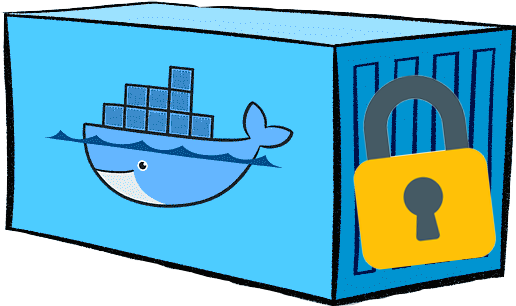
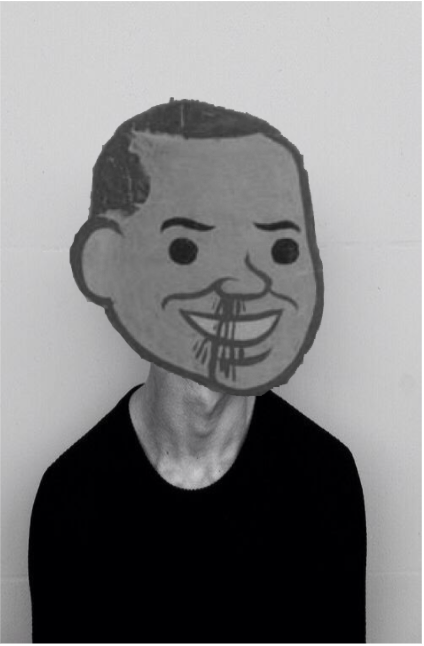
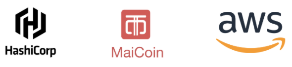

name: Container Security Workshop
class: center

  
# Container Security Workshop
### Protect Container Application from Beginning

---
name: Link-to-Slide-Deck
# The Slide Deck
   
Follow along on your own computer at this link:

### <https://git.io/JJYbI>

---
name: Introduction
class: img-right-full

# Hello!
## I am smalltown
  - MaiCoin Group Lead Site Reliability Engineering
  - Taipei HashiCorp User Group Organizer
  - AWS User Group Taiwan Staff
   

???
介紹自己，提一些關於自己的背景故事，走一遍教室，讓學員介紹他們自己，並且試著了解他們的技術水平

 **帶到課程中會在 Kubernetes 中有很多的操作機會，練習中過程大部分都有程式碼可以參考，所以對於 Kubernetes 一竅不通的人也不用感到害怕，課程本身淺顯易懂，大家放鬆心情愉快地參加今天的課程即可
**

---
name: Outline
# Outline

## CH00 Workshop Environment Setup 
## CH01 Container Image Building 
## CH02 Kubernetes Basic Security I 
## CH03 Kubernetes Basic Security II 
## CH04 Policy as Code 

???
今天整個 Workshop 會花六個小時左右

**底下是今天的上課內容，每一個主題都會有投影片來講解，有些主題有讓大家實際動手做的 Lab，然後再課程的進行中會穿插一些休息時間**

---
name: Have You Ever Used Container?
# Have You Ever Used Container?

.center[]

---
name: Have You Ever Used Kubernetes?
# Have You Ever Used Kubernetes?

.center[]

---
name: Why You are Here?
# Why You are Here?

.center[]