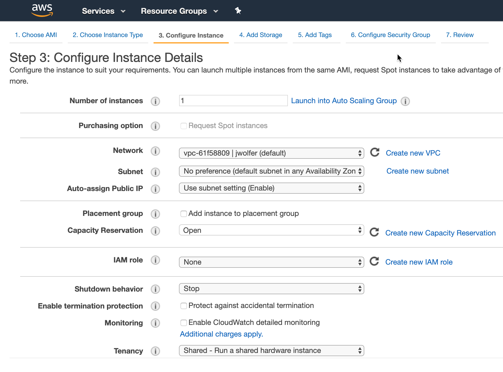

name: IaC Day 1
class: img-caption

# IaC Day 1 - Everything is a Piece of Cake


---
name: intro-to-terraform-demo
class: title
# Chapter 1
## Introduction to Terraform

???
We use the word chapter here, because the training should feel like a story unfolding. The instructor's job is to guide the learners through this interactive story.

---
name: How-to-Provision-an-AWS-Instance
# How to Provision an AWS Instance

Let's look at a few different ways you could provision a new AWS Instance. Before we start we'll need to gather some basic information including (but not limited to):

- Instance Name
- Operating System (Image)
- VM Size
- Geographical Location (Region)
- Security Groups

???
**Has anyone got experience using AWS? How do most of us normally get started? That's right, we log onto the AWS Console and start clicking around. All of the major cloud providers make this part really easy. You get your account, log on and start clicking buttons. Let's take a peek at what that looks like...**

We chose the AWS Console as a starting point because most AWS users will be familiar with it. From this familiar starting point we begin our journey...

---
name: AWS-Console-Provision
# Method 1: AWS Console (GUI)


???
**This should look familiar if you've ever used AWS. From the EC2 Panel, you click on Instances > Launch Instance, and you'll see a list of different AWS Machine Images (AMIs) you can use to provision your Instance. Some of these are provided by AWS, others are provided by third parties in the marketplace. You either search or browse for the thing you need, and click on it. Easy.**

---
name: AWS-Console-Provision-2
# Method 1: AWS Portal (GUI)


???
**Once you've chosen your AMI, you will fill in some more details - the instance type, the VPC you want it to launch in, any associated IAM roles you want to assign it, external storage, tags, security groups... it's a long list of options! The AWS console can be handy for spinning up individual VMs and dev or test environments. The good news is that it's really easy to spin up infrastructure this way. The bad news is that it doesn't scale, and chances are that nobody is keeping track of what got built.**

It's really easy to make a big mess of things if you simply give everyone a console account and turn them loose in the cloud environment.

---
name: CloudFormation-Templates
class: compact
# Method 2: CloudFormation Templates
```json
{
  "AWSTemplateFormatVersion" : "2010-09-09",

  "Description" : "AWS CloudFormation Sample Template EC2InstanceWithSecurityGroupSample: Create an Amazon EC2 instance running the Amazon Linux AMI. The AMI is chosen based on the region in which the stack is run. This example creates an EC2 security group for the instance to give you SSH access. **WARNING** This template creates an Amazon EC2 instance. You will be billed for the AWS resources used if you create a stack from this template.",

  "Parameters" : {
    "KeyName": {
      "Description" : "Name of an existing EC2 KeyPair to enable SSH access to the instance",
      "Type": "AWS::EC2::KeyPair::KeyName",
      "ConstraintDescription" : "must be the name of an existing EC2 KeyPair."
    },
```

CloudFormation Templates provide a consistent and reliable way to provision AWS resources. JSON is easy for computers to read, but can be challenging for humans to edit and troubleshoot.

???
**Which brings us to method #2, CloudFormation Templates, also known as CFTs. Have any of you used CFTs? What's that experience like?**

**CFTs are written in JSON, which stands for JavaScript Object Notation. It is an open-standard format for transmitting data between computers. And don't get me wrong, JSON is great. If you happen to be a computer. Computers are really good at reading these files full of key-value pairs and lists.**

**The problem is that editing and maintaining huge JSON files is hard for humans. Because JSON is not a programming language, you'll end up writing a lot more lines of complex code that is hard to understand and change.**

**CloudFormation Templates - easy for computers to read, hard for humans to troubleshoot and maintain.**

We are not here to bash on CloudFormation Templates or any other JSON/YAML based provisioning tools. The simple fact is these data formats are not well suited for logical operations (if/then, for loops, etc.)

---
name: Provision-with-Terraform-2
# Method 3: Provision with Terraform
```terraform
resource aws_instance "web" {
  ami           = data.aws_ami.ubuntu.id
  instance_type = "t2.micro"

  tags = {
    Name = "HelloWorld"
  }
}
```
.center[Example Terraform code for building an AWS instance.]

???
**And finally we have option #3, Terraform. Terraform uses a Domain Specific Language, or DSL that is designed to be both human-friendly and machine-readable. This is an example snippet of Terraform code. Now watch as I flip back to the previous slide. Would you rather have to write and maintain this complex and messy JSON, or this simple, compact terraform code?**

Advance back to the previous slide to illustrate the difference between JSON and equivalent Terraform.

---
name: What-is-Terraform
# What is Terraform?
```terraform
resource aws_instance "catapp" {
  ami           = data.aws_ami.ubuntu.id
  instance_type = var.instance_type
  tags = {
    Name = "${var.prefix}-meow"
  }
```
* Executable Documentation
* Human and machine readable
* Easy to learn
* Test, share, re-use, automate
* Works on all major cloud providers


???
**So what exactly _is_ Terraform? Terraform is the DNA of your hybrid infrastructure. Terraform code is written in HCL, or HashiCorp Config Language. It is the only programming language designed specifically for provisioning infrastructure on any platform.**

**Do any of you have a wiki or set of runbooks that contain provisioning instructions? Think for a moment about that wiki. Now I want you to imagine the date stamp, when was this thing last edited? Let's say it was four years ago. Do you think maybe something could have changed in the past four years?**

**It sounds funny but the truth is your wiki is the obituary of the last known state of your infrastructure. One of the main reasons to use terraform is because it is self-documenting. The code itself explains every step required to build this infrastructure, and therefore it is always up to date.**

---
name: IaC
# What is Infrastructure as Code?
<br><br><br>
.biglist[
Infrastructure as Code (IaC) is the process of managing and provisioning cloud infrastructure with machine-readable definition files.

**Think of it as executable documentation.**
]

???
**You might be thinking...why can't I just do this by hand? After all the AWS portal is really easy, and I can just stand up my infrastructure manually. Here's why:**

**Terraform ensures that when you build any type of infrastructure that it gets built correctly every single time, exactly the same way. Let's try a thought experiment. If I gave every single one of you the same build document and asked you to set up a server, I guarantee there will be differences in those machines when you hand them over. They may not be major differences, but over time these can pile up and cause all sorts of uncertainty and issues in your environment.**

**When you require hands on keyboards (or mice), and you start making changes and manual steps on your infrastructure, you've lost the automation battle before it even starts. Even a single manual step can slow down your delivery schedule, and introduce unnecessary risk and change to your environments.**

---
name: IaC2
# Infrastructure as Code Allows Us To...
???
**We sometimes call this philosophy 'Infrastructure as Code', or the practice of expressing all of our provisioning steps as machine-readable code and variables. This is also known as the...**

---
name: IaC2
# Infrastructure as Code Allows Us To...
* Provide a codified workflow to create infrastructure
???
**...codified workflow. When you code-ify all of your manual steps, you'll gain several advantages that allow you to provision faster, with more efficiency, while reducing risk.**


---
name: IaC2
# Infrastructure as Code Allows Us To...
* Provide a codified workflow to create infrastructure
* Change and update existing infrastructure
???
**One of the main benefits of IaC is the ability to change and update what you built. There are many tools that allow you to provision infrastructure. This is sometimes called 'Day 0' of operations. The real challenge is managing Day N. What happens when you need to alter the infrastructure you built? Maybe you need to destroy or recreate part or all of it? Are you prepared to maintain and care for this infrastructure, without causing any downtime? Because Terraform is a _stateful_ tool, it can help you keep track of your infrastructure and change it with minimal impact.**

---
name: IaC2
# Infrastructure as Code Allows Us To...
* Provide a codified workflow to create infrastructure
* Change and update existing infrastructure
* Safely test changes using **`terraform plan`** in dry run mode
???
**Do you remember that scene in the movie Jurassic Park, where Samuel L Jackson turns around and says 'hold onto your butts' as he pushes his untested code change into production? Every sysadmin has had that feeling at one time or another. I really hope this works...**

**What if instead we had a way to safely test every change that went into production with a dry run? What would actually happen if I ran this code right now? Terraform comes with a built in dry run mode that allows you to visualize exactly what would happen if you pushed the apply button right now. This is a valuable tool for sysadmins and operations teams who prize stability and uptime.**

**Unexpected changes in the terraform plan output can be investigated _before_ they go into production.**

---
name: IaC2
# Infrastructure as Code Allows Us To...
* Provide a codified workflow to create infrastructure
* Change and update existing infrastructure
* Safely test changes using **`terraform plan`** in dry run mode
* Integrate with application code workflows (Git, CI/CD tools)

???
**Terraform allows you to automate manual processes and build continuous integration or continuous delivery pipelines. Imagine you had a pipeline for creating hardened machine images. Perhaps you have another pipeline for testing your infrastructure build process. These might be chained to other CI/CD application pipelines where the application is deployed into your tested, hardened infrastructure. Think of API driven infrastructure builds, written in a simple langage everybody can use and understand.**

---
name: IaC2
# Infrastructure as Code Allows Us To...
* Provide a codified workflow to create infrastructure
* Change and update existing infrastructure
* Safely test changes using **`terraform plan`** in dry run mode
* Integrate with application code workflows (Git, CI/CD tools)
* Provide reusable modules for easy sharing and collaboration

???
**As you expand your terraform usage, you'll have certain patterns and pieces of your infrastructure that you'd like to re-use. Maybe you want your network security to be set up a certain way, every time. Or perhaps someone wrote a great Terraform config for your web application. Terraform supports custom modules, which are simply packages of pre-built Terraform code that others can use. You can use Terraform modules to avoid repetition, enforce security, and ensure that standards are followed.**

---
name: IaC2
# Infrastructure as Code Allows Us To...
* Provide a codified workflow to create infrastructure
* Change and update existing infrastructure
* Safely test changes using **`terraform plan`** in dry run mode
* Integrate with application code workflows (Git, CI/CD tools)
* Provide reusable modules for easy sharing and collaboration
* Enforce security policy and organizational standards

???
**Terraform Enterprise also supports policy enforcement. You can create a list of dos and do-nots for your users and ensure that people don't build things they shouldn't, or introduce unnecessary risk into your environments. For example, you may have a policy that states that servers should not be exposed to the public internet. Because all your infrastructure is stored as code, you can quickly analyze that code to see if it's breaking any of the rules, preventing the bad behavior *before* the infrastructure gets built.**

---
name: IaC2
# Infrastructure as Code Allows Us To...
* Provide a codified workflow to create infrastructure
* Change and update existing infrastructure
* Safely test changes using **`terraform plan`** in dry run mode
* Integrate with application code workflows (Git, CI/CD tools)
* Provide reusable modules for easy sharing and collaboration
* Enforce security policy and organizational standards
* Enable collaboration between different teams

???
**Now that all your infrastructure is stored in a source code repository, it's very easy for multiple users and teams to collaborate on it. Developer needs a new feature? He or she can easily adjust the source code and send the change back to the operations folks for review. Terraform is a universal language that is understood by both developers and operations teams.**

---
name: IaC-Tools
# Other Infrastructure as Code Tools
.center[]

These tools work well for configuring the operating system and application. They are not purpose-built for provisioning cloud infrastructure and platform services.

???
**Some of you might be thinking, that sounds great but what about this other tool that I use? Why shouldn't I just use Ansible since we already have that? Or my people only do Powershell. These are all great tools. But none of them are specifically designed for provisioning tasks.**

**Chef, Puppet and Ansible all work great in the context of your operating system and applications. It's true that you can do some cloud provisioning with each of these tools, but none of them really work as well as Terraform. And conversely, HashiCorp doesn't have a configuration management tool. Terraform works great with all of these tools.**

---
name: Native-Tools
# Native Cloud Provisioning Tools
.center[]

Each cloud has its own YAML or JSON based provisioning tool.

Terraform can be used across *all* major cloud providers and VM hypervisors.

???
**Every major cloud provider has their own JSON or YAML based provisioning tool. But all of them are written in YAML or JSON. And if you learn one of these systems, guess what, the others are completely different. Now if you want to have a multi-cloud strategy you have to learn three separate provisioning systems. With Terraform you are using the same language, the same simple syntax on all three of these cloud providers.**

---
name: Config-Hell
.center[]
???
**This is a fun web comic. Those of you who have spent hours poking at a nested JSON template, trying to figure out which layer of curly braces you are in will understand this...**

---
Name: Terraform-vs-JSON
# Terraform vs. JSON
CFT JSON:
```json
"name": "{ "Fn::Join" : [ "-", [ PilotServerName, vm ] ] }",
```

Terraform:
```hcl
name = "${var.PilotServerName}-vm"
```

Terraform code (HCL) is easy to learn and easy to read. It is also 50-70% more compact than an equivalent JSON configuration.

---
Name: Why-Terraform-1
# Why Terraform?
.center[]

.center[### <https://blog.1password.com/terraforming-1password/>]

???
1Password did a great blog post illustrating the difference between AWS Cloudformation (JSON) and Terraform.

https://blog.1password.com/terraforming-1password/

1Password were able to move their entire production infrastructure to Terraform in a few short weeks. Now they can tear down and completely rebuild their production environment in a matter of hours.

---
Name: Why-Terraform-on-AWS
# Why Terraform on AWS?

* Supports multi-cloud & hybrid infrastructure

???
**Why specifcially should you use Terraform on AWS? The first reason is that Terraform supports your hybrid or multi-cloud strategy. If you need to build some infrastructure on-prem, and some in AWS, Terraform is a natural fit. Your technical staff only has to learn a single language to be able to provision in either environment.**

---
Name: Why-Terraform-on-AWS
# Why Terraform on AWS?

* Supports multi-cloud & hybrid infrastructure
* Migrate from other cloud providers

???
**Terraform is also great for migrating between cloud providers. Let's say you wanted to move some workloads from AWS to AWS. The code changes in Terraform would be much easier to implement than they would via CloudFormation Templates. I was able to migrate a simple demo application from one cloud to another in a few short hours, because there was almost no learning curve. Terraform code looks the same no matter where you run it.**

---
Name: Why-Terraform-on-AWS
# Why Terraform on AWS?

* Supports multi-cloud & hybrid infrastructure
* Migrate from other cloud providers
* Increase provisioning speed

???
**It's not unusual to see provisioning times drop from days or weeks to hours or minutes when users adopt Terraform. Ineffective manual steps and change approvals can be replaced with fast code pipelines that have rigorous testing and security built right in. Now instead of waiting for days for a change request to be approved, users can self-provision their infrastructure without bottlenecks or slow approval processes.**

---
Name: Why-Terraform-on-AWS
# Why Terraform on AWS?

* Supports multi-cloud & hybrid infrastructure
* Migrate from other cloud providers
* Increase provisioning speed
* Improve efficiency

???
**Have you heard the saying 'measure twice, cut once?'? Terraform forces your operations teams to be disciplined and consistent with every single build. Have a change or setting that was overlooked during the build? Now you can immediately correct that mistake inside the code, so that a particular step never gets missed again. All future builds will contain the change. This can also improve relations between developers and operations, because the contract is clear. What gets built is always defined in the code, and never left to guesswork or manual processes.**

---
Name: Why-Terraform-on-AWS
# Why Terraform on AWS?

* Supports multi-cloud & hybrid infrastructure
* Migrate from other cloud providers
* Increase provisioning speed
* Improve efficiency
* Reduce risk

???
**Every modern IT organization has to deal with risk. It's a balancing act between security and usability. You can make it so secure nobody can use it, or on the other end you have a free for all where users can do whatever they want, but are putting the entire cloud account in jeopardy due to risky behavior. Terraform allows you to reduce risk by abstracting your users away from the web UI or API. Instead we provide a safe, auditable abstraction layer that lets users get their work done in a secure and safe way, that doesn't grant unnecessary privileged access.**