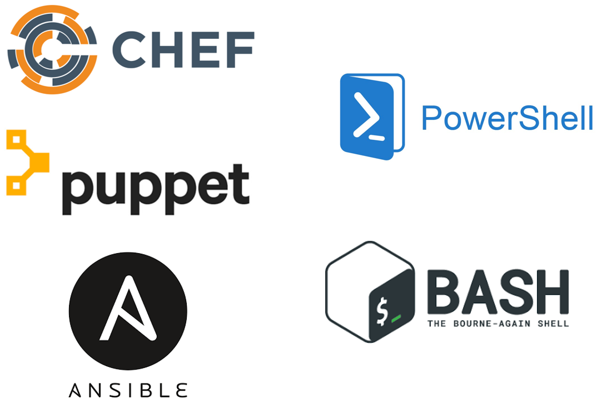

name: IaC Day 1
class: img-caption

# IaC Day 1 - Everything is a Piece of Cake


???
雖然俗話說萬事起頭難，但自己 Build Infra 的經驗，其實要學習一個新的技術跟後續的維護比起來，自己覺得是相對簡單的，這也是我剛開始學習 Terraform 的感想，他真的很容易就可以學會，很多東西也都很貼心的事先幫忙想到了

---
name: intro-to-terraform-demo
class: title
# Chapter 1
## Introduction to Terraform

???
好的，那讓我們開始來介紹 Terraform 到底是什麼樣的一個工具

---
name: How-to-Provision-an-AWS-Instance
# How to Provision an AWS Instance

Let's look at a few different ways you could provision a new AWS Instance. Before we start we'll need to gather some basic information including (but not limited to):

- Instance Name
- Operating System (Image)
- VM Size
- Geographical Location (Region)
- Security Groups

???

**有用過 AWS 的人可以幫我舉一下手嗎？通常一開始都是怎麼使用它的呢？當然就是先登入，然後開始點來點去的，每一家 Cloud Provider 都把這個部分弄的很簡單，讓你只要開好帳號登入把信用卡綁好後，隨便點一點，就可以把機器開好**

---
name: AWS-Console-Provision
# Method 1: AWS Console (GUI)


???

**有用過 AWS 的人一定會對這個畫面感到很熟悉，從 EC2 Panel 按下 Launch Instance 就可以看到各種不同的作業系統 Image 可供選擇，有些是 AWS 提供的，有些是第三方廠商提供的，你可以用搜尋功能找到你想要作業系統 Image，然後點一下就可以了**

---
name: AWS-Console-Provision-2
# Method 1: AWS Portal (GUI)


???

**選擇好要開的機器 Image 之後，會有更多的東西需要填，例如機器的型別，要開在哪一個 VPC，有沒有要綁定 IAM Role，硬碟要多大，Security Group 要哪一個...要選擇的東西真的是很多，AWS Console 只能讓你用手動地來決定這些值要填什麼，不過好消息在於用這樣的方式可以很快地就把一台新的機器給開起來，壞消息是這樣的做法是無法 Scale 的，因為沒有人知道你做過什麼事情；所以假如你給每一個人一個可以登入 AWS Console 的帳號，到頭來一定會變得一團糟**

---
name: CloudFormation-Templates
class: compact
# Method 2: CloudFormation Templates
```json
{
  "AWSTemplateFormatVersion" : "2010-09-09",

  "Description" : "AWS CloudFormation Sample Template EC2InstanceWithSecurityGroupSample: Create an Amazon EC2 instance running the Amazon Linux AMI. The AMI is chosen based on the region in which the stack is run. This example creates an EC2 security group for the instance to give you SSH access. **WARNING** This template creates an Amazon EC2 instance. You will be billed for the AWS resources used if you create a stack from this template.",

  "Parameters" : {
    "KeyName": {
      "Description" : "Name of an existing EC2 KeyPair to enable SSH access to the instance",
      "Type": "AWS::EC2::KeyPair::KeyName",
      "ConstraintDescription" : "must be the name of an existing EC2 KeyPair."
    },
```

CloudFormation Templates provide a consistent and reliable way to provision AWS resources. JSON is easy for computers to read, but can be challenging for humans to edit and troubleshoot.

???

第二種方法是使用 CloudFormation 範本，你們有人用過嗎？使用完的感想是?

**CloudFormation 使用 JSON 或是 YAML 撰寫，這些格式在機器間可以很容易地被閱讀，但對人類來說並不是，對於人類來說要編輯跟維護 JSON 和 YAML 是一件很難的事情，寫得越多導致越難理解也越難改動，所以 Cloudformation 對於機器來說很好閱讀，但是對於人類來說很難維護跟查找問題**

**我在這邊並不是要故意說 Cloudformation 或是其他使用 JSON/YAML 來達成 Provision 的工具不好，而是一個很簡單的事實就擺在眼前，這種資料格式不適合邏輯性的開發跟操作**

---
name: Provision-with-Terraform-2
# Method 3: Provision with Terraform
```terraform
resource aws_instance "web" {
  ami           = data.aws_ami.ubuntu.id
  instance_type = "t2.micro"

  tags = {
    Name = "HelloWorld"
  }
}
```
.center[Example Terraform code for building an AWS instance.]

???

**最後一個方法當然就是使用 Terraform，Terraform 使用 DSL，而該語言被特地設計成對於人類使用起來友善，而且機器也可以閱讀的一種語言，這邊可以看到 Terraform 的 Sample Code，讓我們再回去看看剛剛那幾頁，大家可以在心裡思考一下，你是想要撰寫跟維護很複雜的 JSON/YAML 資料格式，還是這個如此簡單精實的 Terraform?!**

---
name: What-is-Terraform
# What is Terraform?
```terraform
resource aws_instance "catapp" {
  ami           = data.aws_ami.ubuntu.id
  instance_type = var.instance_type
  tags = {
    Name = "${var.prefix}-meow"
  }
```
* Executable Documentation
* Human and machine readable
* Easy to learn
* Test, share, re-use, automate
* Works on all major cloud providers


???

**所以讓我們認識一下 Terraform 是什麼東西，Terraform 可以說是混和架構下的 DNA，撰寫 Terraform 的程式碼為 HCL (HashiCorp Config Language)，他是目前可以 Provision 最多種平台的程式語言**

**回想一下你們的部門是不是有 Wiki 或是任何的文件用來紀錄如何 Provision 某個系統的步驟，現在請回想一下那個文件的頁面，然後想像一下頁面上的編輯時間，最後的編輯時間是什麼時候呢？可能是四年前了，你覺得有沒有可能有什麼東西在這四年間有改變了？**

**聽起來或許很好笑，但事實是這個看起來不可信的 Wiki 是運行中服務架構的最後宣告狀態，而建議使用 Terraform 最主要的理由之一就在於他本身就像是文件一樣，程式碼的本身解釋了建立此服務架構的每一個步驟，因此他總是不會過時**

---
name: IaC
# What is Infrastructure as Code?
<br><br><br>
.biglist[
Infrastructure as Code (IaC) is the process of managing and provisioning cloud infrastructure with machine-readable definition files.

**Think of it as executable documentation.**
]

???

**或許你會想說...為什麼我不能用手點一點就好，畢竟使用 AWS 管理介面真的很容易，所以可以手動來建立起服務架構即可**

**因為透過 Terraform 才能夠達成每一次建立的所有服務架構都是使用同樣的方式，試想你現在被要求根據拿到安裝文件來建立一個完整的服務架構，我敢保證，在手動建立的過程中，每一次都會有所不同，或許某一些設定不一樣不是很嚴重，但是這些不確定性將會是造成系統環境出問題的各種原因**

**當需要透過鍵盤或是滑鼠來手動變更服務架構的時候，將會在一開始就失去自動化的可能性，即使只有一個步驟是需要手動進行的，這都會使交付的速度變慢，並且對你的環境增加不確定的風險**

---
name: IaC2
# Infrastructure as Code Allows Us To...
???

**而這樣的做法我們稱之為 Infrastructure as Code，也就是把安裝的步驟變成機器可以理解的程式碼跟變數... **

---
name: IaC2
# Infrastructure as Code Allows Us To...
* Provide a codified workflow to create infrastructure
???

****
**...codified workflow. When you code-ify all of your manual steps, you'll gain several advantages that allow you to provision faster, with more efficiency, while reducing risk.**


---
name: IaC2
# Infrastructure as Code Allows Us To...
* Provide a codified workflow to create infrastructure
* Change and update existing infrastructure
???
**One of the main benefits of IaC is the ability to change and update what you built. There are many tools that allow you to provision infrastructure. This is sometimes called 'Day 0' of operations. The real challenge is managing Day N. What happens when you need to alter the infrastructure you built? Maybe you need to destroy or recreate part or all of it? Are you prepared to maintain and care for this infrastructure, without causing any downtime? Because Terraform is a _stateful_ tool, it can help you keep track of your infrastructure and change it with minimal impact.**

---
name: IaC2
# Infrastructure as Code Allows Us To...
* Provide a codified workflow to create infrastructure
* Change and update existing infrastructure
* Safely test changes using **`terraform plan`** in dry run mode
???
**Do you remember that scene in the movie Jurassic Park, where Samuel L Jackson turns around and says 'hold onto your butts' as he pushes his untested code change into production? Every sysadmin has had that feeling at one time or another. I really hope this works...**

**What if instead we had a way to safely test every change that went into production with a dry run? What would actually happen if I ran this code right now? Terraform comes with a built in dry run mode that allows you to visualize exactly what would happen if you pushed the apply button right now. This is a valuable tool for sysadmins and operations teams who prize stability and uptime.**

**Unexpected changes in the terraform plan output can be investigated _before_ they go into production.**

---
name: IaC2
# Infrastructure as Code Allows Us To...
* Provide a codified workflow to create infrastructure
* Change and update existing infrastructure
* Safely test changes using **`terraform plan`** in dry run mode
* Integrate with application code workflows (Git, CI/CD tools)

???
**Terraform allows you to automate manual processes and build continuous integration or continuous delivery pipelines. Imagine you had a pipeline for creating hardened machine images. Perhaps you have another pipeline for testing your infrastructure build process. These might be chained to other CI/CD application pipelines where the application is deployed into your tested, hardened infrastructure. Think of API driven infrastructure builds, written in a simple langage everybody can use and understand.**

---
name: IaC2
# Infrastructure as Code Allows Us To...
* Provide a codified workflow to create infrastructure
* Change and update existing infrastructure
* Safely test changes using **`terraform plan`** in dry run mode
* Integrate with application code workflows (Git, CI/CD tools)
* Provide reusable modules for easy sharing and collaboration

???
**As you expand your terraform usage, you'll have certain patterns and pieces of your infrastructure that you'd like to re-use. Maybe you want your network security to be set up a certain way, every time. Or perhaps someone wrote a great Terraform config for your web application. Terraform supports custom modules, which are simply packages of pre-built Terraform code that others can use. You can use Terraform modules to avoid repetition, enforce security, and ensure that standards are followed.**

---
name: IaC2
# Infrastructure as Code Allows Us To...
* Provide a codified workflow to create infrastructure
* Change and update existing infrastructure
* Safely test changes using **`terraform plan`** in dry run mode
* Integrate with application code workflows (Git, CI/CD tools)
* Provide reusable modules for easy sharing and collaboration
* Enforce security policy and organizational standards

???
**Terraform Enterprise also supports policy enforcement. You can create a list of dos and do-nots for your users and ensure that people don't build things they shouldn't, or introduce unnecessary risk into your environments. For example, you may have a policy that states that servers should not be exposed to the public internet. Because all your infrastructure is stored as code, you can quickly analyze that code to see if it's breaking any of the rules, preventing the bad behavior *before* the infrastructure gets built.**

---
name: IaC2
# Infrastructure as Code Allows Us To...
* Provide a codified workflow to create infrastructure
* Change and update existing infrastructure
* Safely test changes using **`terraform plan`** in dry run mode
* Integrate with application code workflows (Git, CI/CD tools)
* Provide reusable modules for easy sharing and collaboration
* Enforce security policy and organizational standards
* Enable collaboration between different teams

???
**Now that all your infrastructure is stored in a source code repository, it's very easy for multiple users and teams to collaborate on it. Developer needs a new feature? He or she can easily adjust the source code and send the change back to the operations folks for review. Terraform is a universal language that is understood by both developers and operations teams.**

---
name: IaC-Tools
# Other Infrastructure as Code Tools
.center[]

These tools work well for configuring the operating system and application. They are not purpose-built for provisioning cloud infrastructure and platform services.

???
**Some of you might be thinking, that sounds great but what about this other tool that I use? Why shouldn't I just use Ansible since we already have that? Or my people only do Powershell. These are all great tools. But none of them are specifically designed for provisioning tasks.**

**Chef, Puppet and Ansible all work great in the context of your operating system and applications. It's true that you can do some cloud provisioning with each of these tools, but none of them really work as well as Terraform. And conversely, HashiCorp doesn't have a configuration management tool. Terraform works great with all of these tools.**

---
name: Native-Tools
# Native Cloud Provisioning Tools
.center[]

Each cloud has its own YAML or JSON based provisioning tool.

Terraform can be used across *all* major cloud providers and VM hypervisors.

???
**Every major cloud provider has their own JSON or YAML based provisioning tool. But all of them are written in YAML or JSON. And if you learn one of these systems, guess what, the others are completely different. Now if you want to have a multi-cloud strategy you have to learn three separate provisioning systems. With Terraform you are using the same language, the same simple syntax on all three of these cloud providers.**

---
name: Config-Hell
.center[]
???
**This is a fun web comic. Those of you who have spent hours poking at a nested JSON template, trying to figure out which layer of curly braces you are in will understand this...**

---
Name: Terraform-vs-JSON
# Terraform vs. JSON
CFT JSON:
```json
"name": "{ "Fn::Join" : [ "-", [ PilotServerName, vm ] ] }",
```

Terraform:
```hcl
name = "${var.PilotServerName}-vm"
```

Terraform code (HCL) is easy to learn and easy to read. It is also 50-70% more compact than an equivalent JSON configuration.

---
Name: Why-Terraform-1
# Why Terraform?
.center[]

.center[### <https://blog.1password.com/terraforming-1password/>]

???
1Password did a great blog post illustrating the difference between AWS Cloudformation (JSON) and Terraform.

https://blog.1password.com/terraforming-1password/

1Password were able to move their entire production infrastructure to Terraform in a few short weeks. Now they can tear down and completely rebuild their production environment in a matter of hours.

---
Name: Why-Terraform-on-AWS
# Why Terraform on AWS?

* Supports multi-cloud & hybrid infrastructure

???
**Why specifcially should you use Terraform on AWS? The first reason is that Terraform supports your hybrid or multi-cloud strategy. If you need to build some infrastructure on-prem, and some in AWS, Terraform is a natural fit. Your technical staff only has to learn a single language to be able to provision in either environment.**

---
Name: Why-Terraform-on-AWS
# Why Terraform on AWS?

* Supports multi-cloud & hybrid infrastructure
* Migrate from other cloud providers

???
**Terraform is also great for migrating between cloud providers. Let's say you wanted to move some workloads from AWS to AWS. The code changes in Terraform would be much easier to implement than they would via CloudFormation Templates. I was able to migrate a simple demo application from one cloud to another in a few short hours, because there was almost no learning curve. Terraform code looks the same no matter where you run it.**

---
Name: Why-Terraform-on-AWS
# Why Terraform on AWS?

* Supports multi-cloud & hybrid infrastructure
* Migrate from other cloud providers
* Increase provisioning speed

???
**It's not unusual to see provisioning times drop from days or weeks to hours or minutes when users adopt Terraform. Ineffective manual steps and change approvals can be replaced with fast code pipelines that have rigorous testing and security built right in. Now instead of waiting for days for a change request to be approved, users can self-provision their infrastructure without bottlenecks or slow approval processes.**

---
Name: Why-Terraform-on-AWS
# Why Terraform on AWS?

* Supports multi-cloud & hybrid infrastructure
* Migrate from other cloud providers
* Increase provisioning speed
* Improve efficiency

???
**Have you heard the saying 'measure twice, cut once?'? Terraform forces your operations teams to be disciplined and consistent with every single build. Have a change or setting that was overlooked during the build? Now you can immediately correct that mistake inside the code, so that a particular step never gets missed again. All future builds will contain the change. This can also improve relations between developers and operations, because the contract is clear. What gets built is always defined in the code, and never left to guesswork or manual processes.**

---
Name: Why-Terraform-on-AWS
# Why Terraform on AWS?

* Supports multi-cloud & hybrid infrastructure
* Migrate from other cloud providers
* Increase provisioning speed
* Improve efficiency
* Reduce risk

???
**Every modern IT organization has to deal with risk. It's a balancing act between security and usability. You can make it so secure nobody can use it, or on the other end you have a free for all where users can do whatever they want, but are putting the entire cloud account in jeopardy due to risky behavior. Terraform allows you to reduce risk by abstracting your users away from the web UI or API. Instead we provide a safe, auditable abstraction layer that lets users get their work done in a secure and safe way, that doesn't grant unnecessary privileged access.**