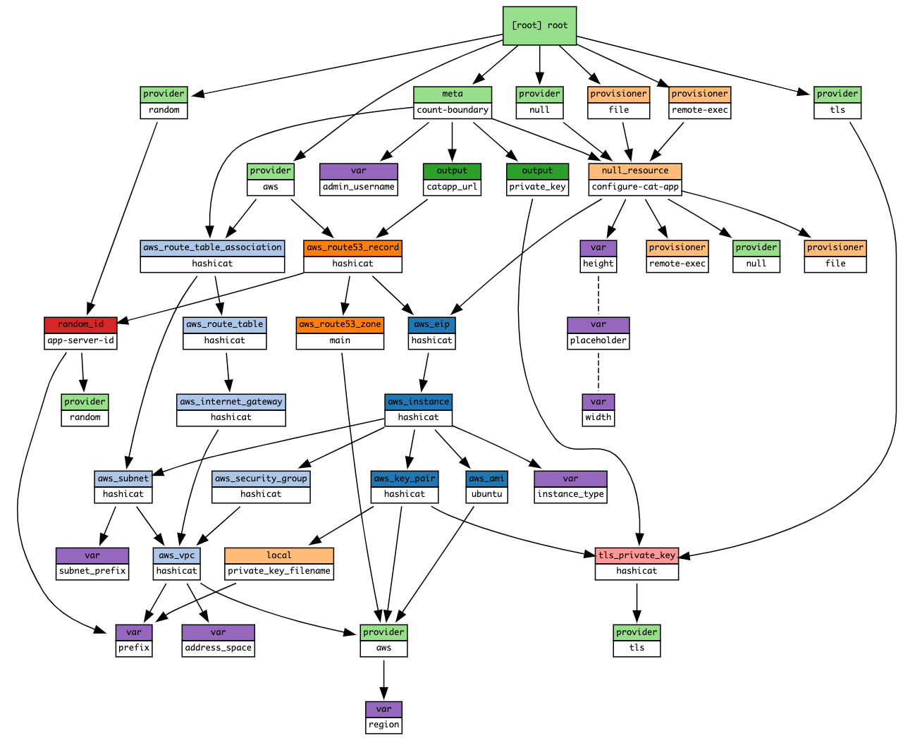

name: Chapter-3
class: title
# Chapter 3
## Terraform in Action

???
**In this chapter we'll actually build real infrastructure using our sample code.**

---
name: anatomy-of-a-resource
# Anatomy of a Resource
Every terraform resource is structured exactly the same way.

```terraform
resource type "name" {
  parameter = "foo"
  parameter2 = "bar"
  list = ["one", "two", "three"]
}
```

**resource** = Top level keyword<br>
**type** = Type of resource. Example: `aws_instance`.<br>
**name** = Arbitrary name to refer to this resource. Used internally by terraform. This field *cannot* be a variable.

???
Everything else you want to configure within the resource is going to be sandwiched between the curly braces. These can include strings, lists, and maps.

---
name: provider-block
# Terraform Provider Configuration
The terraform core program requires at least one provider to build anything.

You can manually configure which version(s) of a provider you would like to use. If you leave this option out, Terraform will default to the latest available version of the provider.

```hcl
provider "aws" {
  version = "=2.35.0"
}
```

---
name: provider-versioning
# Versioning Operators

```tex
- = (or no operator): exact version equality
- !=: version not equal
- \>, >=, <, <=: version comparison
- ~>: pessimistic constraint, constraining both the oldest and newest
version allowed. ~> 0.9 is equivalent to >= 0.9, < 1.0, and ~> 0.8.4
is equivalent to >= 0.8.4, < 0.9
```
Re-usable modules should constrain only the minimum allowed version, such as >= 2.35.0.

???
**This specifies the earliest version that the module is compatible with while leaving the user of the module flexibility to upgrade to newer versions of Terraform without altering the module.**

---

name: terraform-apply
class: compact
# Terraform Apply
```tex
*$ terraform apply
An execution plan has been generated and is shown below.

Terraform will perform the following actions:
  # aws_vpc.main will be created
  + resource "aws_vpc" "main" {
      + cidr_block                       = "10.0.0.0/16"
      + instance_tenancy                 = "dedicated"
        ...
      + tags                             = {
          + "Name" = "main"
        }
    }

Plan: 1 to add, 0 to change, 0 to destroy.
```
`terraform apply` runs a plan and then if you approve, it applies the changes.

---
name: terraform-destroy
class: compact
# Terraform Destroy
```tex
*$ terraform destroy
An execution plan has been generated and is shown below.

Terraform will perform the following actions:
  # aws_vpc.main will be destroyed
  - resource "aws_vpc" "main" {
      - cidr_block                       = "10.0.0.0/16" -> null
      - instance_tenancy                 = "dedicated" -> null
        ...
      - tags                             = {
          - "Name" = "main"
        } -> null
    }

Plan: 0 to add, 0 to change, 1 to destroy.
```
`terraform destroy` does the opposite. If you approve, your infrastructure is destroyed.
???
**Terraform can just as easily destroy infrastructure as create it. With great power comes great responsibility!**

---
name: terraform-fmt
# Terraform Format
Terraform comes with a built in code formatter/cleaner. It can make all your margins and list indentation neat and tidy. Beauty works better.

```tex
terraform fmt
```

Simply run it in a directory containing *.tf files and it will tidy up your code for you.

---

name: Data-Sources
class: compact
# Terraform Data Sources

```terraform
data "aws_ami" "ubuntu" {
  most_recent = true
  filter {
    name   = "name"
    values = ["ubuntu/images/hvm-ssd/ubuntu-trusty-14.04-amd64-server-*"]
  }
  filter {
    name   = "virtualization-type"
    values = ["hvm"]
  }
  owners = ["099720109477"] # Canonical
}
```
Data sources are a way of querying a provider to return an existing resource, so that we can access its parameters for our own use.

---

name: dependency-mapping
class: compact
# Terraform Dependency Mapping
Terraform can automatically keep track of dependencies for you. Look at the two resources below. Note the highlighted lines in the aws_instance resource. This is how we tell one resource to refer to another in terraform.

```terraform
resource aws_key_pair "my-keypair" {
  key_name   = "my-keypair"
  public_key = file(var.public_key)
}

resource "aws_instance" "web" {
* ami           = data.aws_ami.ubuntu.id
  instance_type = "t2.micro"
* key_name      = aws_key_pair.my-keypair.name
```
???
**Apart from the SSH keypair, you can also see how we reference the data source block from the previous slide. Flick back to the previous slide to show the relationship.**

---
name: organizing-your-terraform
# Organize Your Terraform Code
Terraform will read any file in your workspace that ends in a `.tf` extension, but the convention is to have a main.tf, variables.tf, and outputs.tf. You may add more tf files if you wish.

```bash
main.tf
variables.tf
outputs.tf
```

Let's take a closer look at each of these files.

---
name: terraform-main
class: compact
# The Main File

The first file is called main.tf. This is where you normally store your terraform code. With larger, more complex infrastructure you might break this up across several files.

```bash
# This is the main.tf file.
resource aws_vpc "main" {
  cidr_block       = var.cidr_block
  instance_tenancy = var.instance_tenancy
}

resource aws_subnet "main" {
  vpc_id     = aws_vpc.main.id
  cidr_block = var.cidr_block
  }
}
...
```

???
**We've removed all the comments from this code so it will fit on the slide.**

---
name: terraform-variables
class: compact
# The Variables File

The second file is called variables.tf. This is where you define your variables and optionally set some defaults.

```bash
variable "cidr_block" {
  description = "The address space that is used within the VPC. Changing this forces a new resource to be created."
}

variable "instance_tenancy" {
  description = "A tenancy option for instances launched into the VPC. Acceptable values are 'dedicated' and ''"
  default     = "dedicated"
}
```

---
name: terraform-outputs
class: compact
# The Outputs File
The outputs file is where you configure any messages or data you want to show at the end of a terraform apply.

```terraform
output "catapp_url" {
  value = "http://${aws_route53_record.hashicat.fqdn}"
}


output "private_key" {
  value = "${tls_private_key.hashicat.private_key_pem}"
}
```

???
**This bit here with the EOF is an example of a HEREDOC. It allows you store multi-line text in an output.**

---
name: tf-dependency-graph
class: img-right
# Terraform Dependency Graph
.center[]

The terraform resource graph visually depicts dependencies between resources.

???
This is a good spot to talk a bit about how the dependency graph gets formed.

---
name: lab-exercise-2a
# 👩‍💻 Lab Exercise: Terraform in Action
Let's use Terraform to build, manage, and destroy AWS resources. This is a three part lab. In part one you'll build the HashiCat application stack.

Your instructor will provide the URL for the second lab environment. Bookmark it for easy reference.

You will need to set up your workstation again in the first challenge. This is expected as we create a new instance for each lab.

🛑 **STOP** after you complete the third quiz.

???
**We will explore the Terraform Graph together once everyone has completed the lab. Once you have the graph running in your instruqt lab stop there.**

---
name: chapter-3-review
# 📝 Chapter 3 Review

In this chapter we:
* Learned about Terraform resources
* Ran terraform plan, graph, apply and destroy
* Learned about dependencies
* Viewed a graph of the lab
* Looked at main.tf, variables.tf and outputs.tf
* Built the Meow World application
