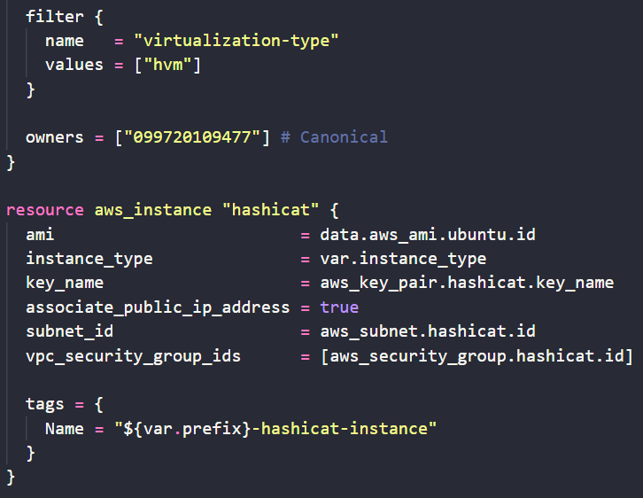
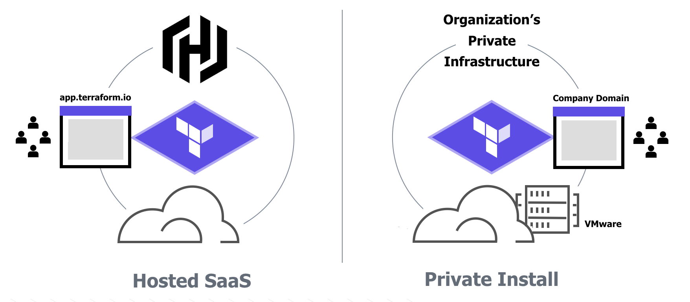
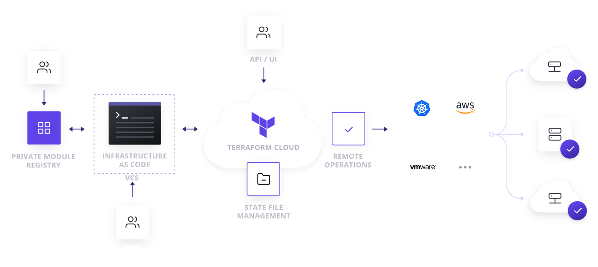
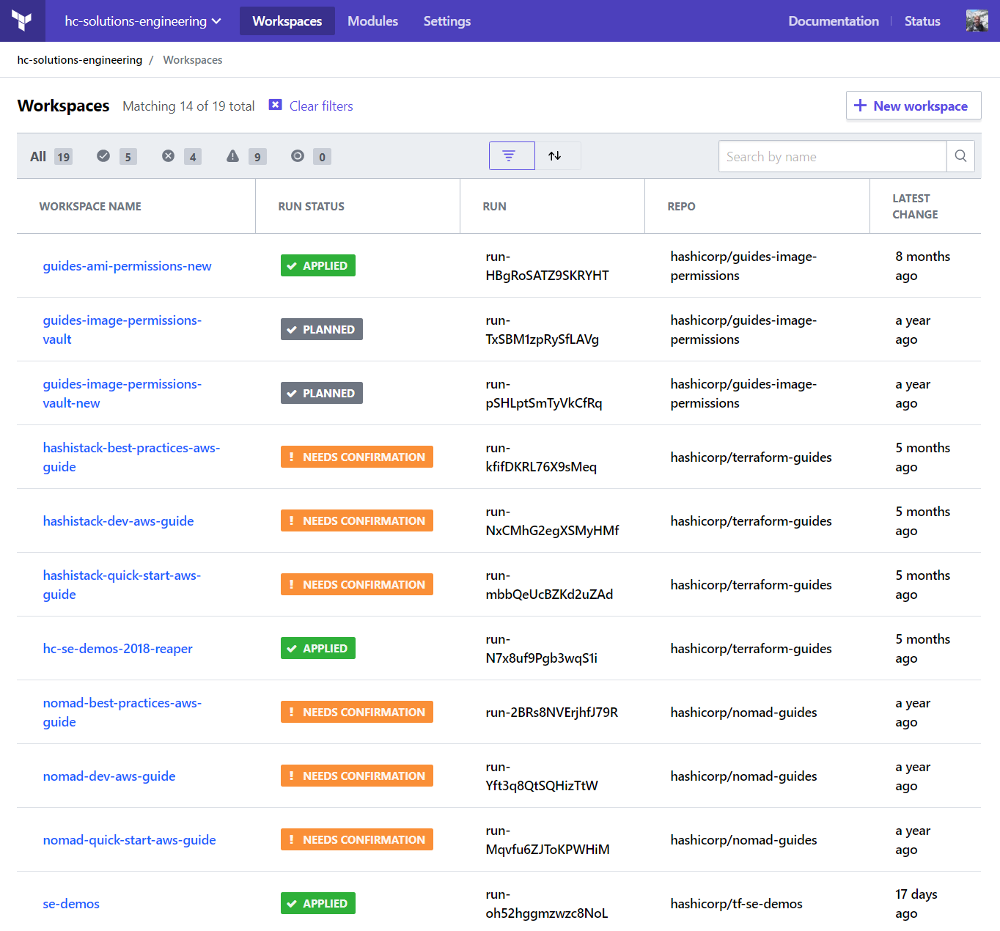
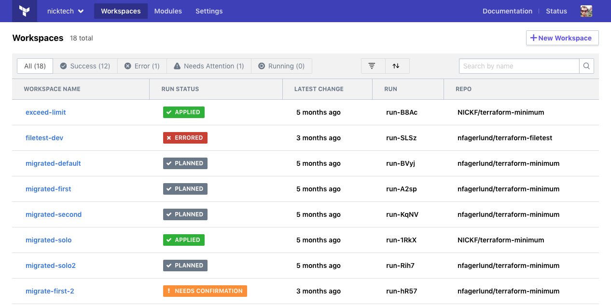
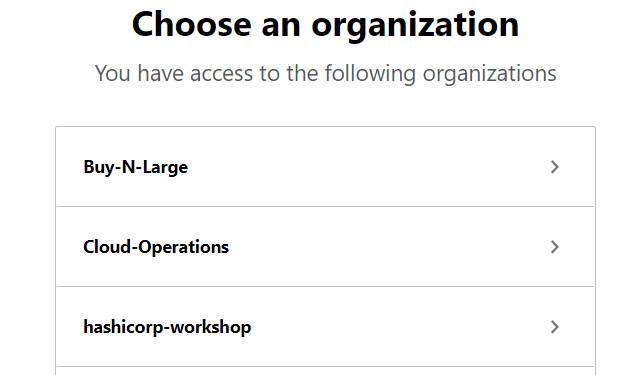
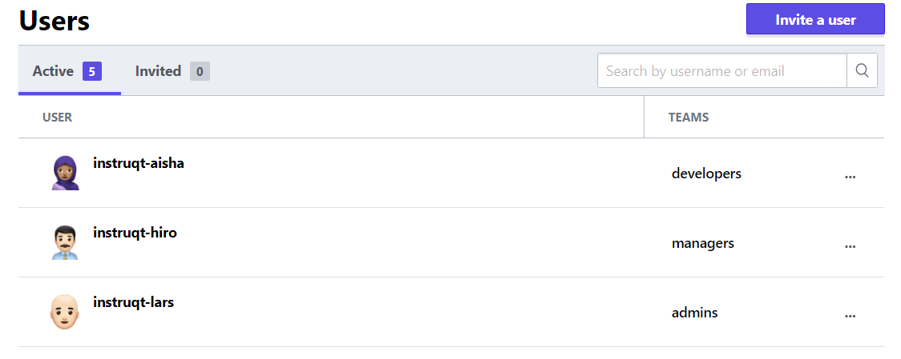
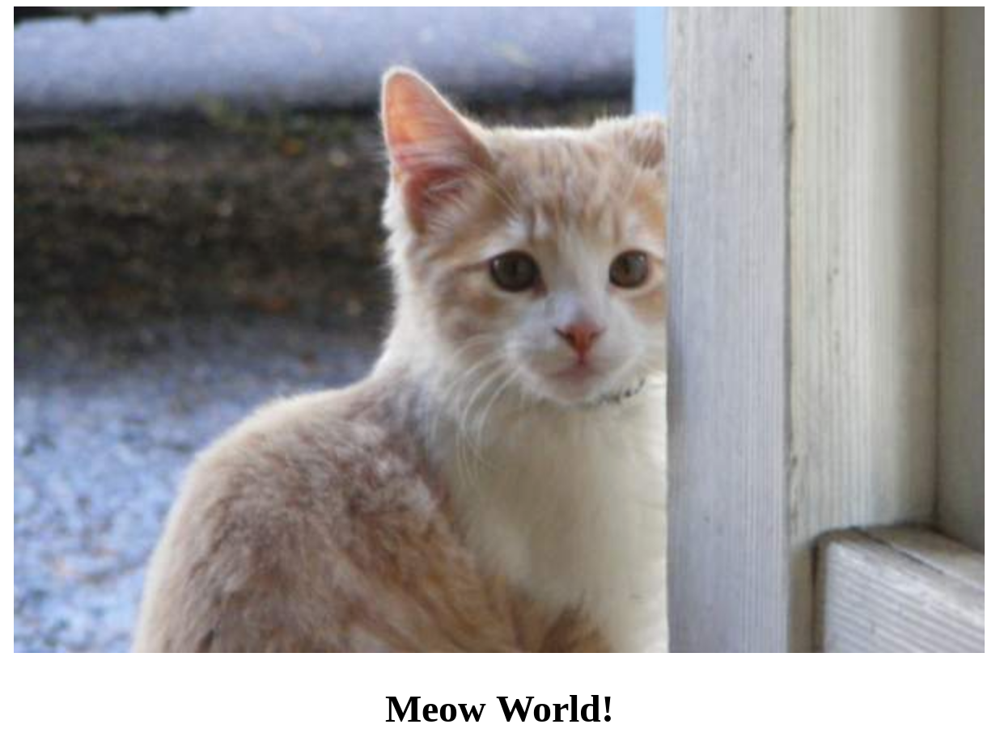

name: IaC Day 2
class: img-caption

# IaC Day 2 - Life is Hard


---
class: title
# Chapter 6
## Terraform OSS, Cloud and Enterprise

???
**In the first chapter we'll cover Terraform open source and some of the differences between OSS and Cloud and Enterprise.**

---
name: infrastructure-as-code
class: col-2
# Infrastructure as Code

* Terraform code is written in HCL
* Stop building things by hand
* Put everything into repeatable Terraform configuration
* All build steps are now expressed as code
* If you ever have to rebuild something, it's much easier!



???
**At the core of Terraform is this idea of Infrastructure as Code. Instead of building things as a series of manual steps, or error-prone shell scripts that may or may not be tested and up to date, you express all your infrastructure build steps in this simple Domain Specific Language, or terraform. The official name for the Terraform config syntax is Hashicorp Config Language, or HCL. This language is easy for beginners and powerful for experts. Think of it as the DNA of your infrastructure.**

This slide is here in case you have any brand new, or non-technical people who have never seen a terraform resource before.

---
name: multi-platform-compliance
# Manage All Your Infrastructure
.center[

]

Terraform also integrates with on premise VMs or platform services.

???
**Terraform Cloud and Enterprise can be used to build VMs in your data center, or AWS instances in the cloud, or both. You won't have to maintain two sets of tools to build on your hybrid cloud platforms.**

---
name: self-service-infra
# Self-Service Infrastructure

.center[

]

Enable users to build what they need without running up a huge bill or putting your organization at risk.

???
**Terraform Cloud encourages safe provisioning via reusable modules and policy enforcement. Now users can build exactly what they need to do their jobs without breaking things or putting your organization at risk. A slow and cumbersome approval process is no longer required because the automation enforces best practices without manual code reviews.**

---
name: terraform-cloud-what-is-it
# Terraform Cloud - The Big Picture

.center[

]

???
**This slide shows the end state of our workshop. Over on the left our infrastructure folks have created some reusable modules that the rest of our users can implement in their own terraform code. These modules ensure that infrastructure components like networks and VMs get built correctly every time, and they also make it easy for the user to build the "right stuff" on their own.**

**In the next stage our user is writing terraform code and checking it into a Version Control System. This ensures that each and every change meant for production is recorded and reviewed. This is so important. It requires discipline and cooperation from all of your devops and infrastructure admins. When new code is committed to the master branch it triggers a plan in Terraform Cloud (or Enterprise)**

**Think of Terraform Cloud as a remote execution and state management platform for Terraform. Now you're not running terraform on your laptop like it's the wild west of cloud provisioning; instead all terraform runs happen in secure docker containers that run on our SaaS platform, or in your own data center. This allows you to encrypt and secure all your API keys, variables, and terraform state files. Access is granted only to authorized users.**

**All your terraform state files are safely stored and encrypted on the server side. Any time you need to make a change to any of your infrastructure, Terraform knows the last state it was in and can build incrementally based on what has changed. Need to add more instances to a cluster? No problem, terraform can do that for you without a complete tear-down and rebuild.**

**Before every terraform apply, you can run Sentinel policy checks against the proposed infrastructure plan to catch any policy violations. For example you might not want the devs creating super XL instances that cost a lot of money to run. You can write a simple rule that restricts developer workspaces to only using m3.medium sized instances, unless they get special permission for more.**

**Role-based access controls allow different types of users to interact with Terraform cloud according to their level of access. You might have super admins who can control everything in the organization, then regular users who can run terraform but only in dev environments. Another group might be able to push changes to production, while some users may have read-only access. Terraform Cloud/Enterprise is a true multi-tenant application.**

---
name: why-tfc-1
class: img-right
# Terraform Cloud


Terraform Cloud is a SaaS application that provides the following features:

???
**Let's go through a quick bullet list of Terraform Cloud features and why they matter.**

---
name: why-tfc-2
class: img-right
# Terraform Cloud


Terraform Cloud is a SaaS application that provides the following features:

* UI integration with VCS

???
**As your organization begins to standardize on Terraform, you'll have different types of users. Most of you will become terraform experts, but there may be others who just want to build things. They can use the terraform code that folks like you have written. To make this process easy, we have a web application. You log on, click a button, and out pops your infrastructure.**

---
name: why-tfc-3
class: img-right
# Terraform Cloud


Terraform Cloud is a SaaS application that provides the following features:

* UI integration with VCS
* API driven workflows

???
**For our more advanced users we have a fully featured RESTful API. This is useful for programmatic access to terraform features. You can drive terraform plan and apply commands using an API interface. If you have a CI/CD pipeline you can automate your terraform builds as part of your process.**

**APIs are the building blocks of any modern cloud automation system. By using standard, well defined APIs you ensure that your infrastructure pipelines will be ready to adapt to any future changes.**

---
name: why-tfc-4
class: img-right
# Terraform Cloud


Terraform Cloud is a SaaS application that provides the following features:

* UI integration with VCS
* API driven workflows
* Central state management

???
**Terraform enterprise also provides safe and secure storage for your state files. Instead of having that important state file stored on someone's laptop, now it is safely stored in the Terraform Cloud application. Only those who need access to the state file can see it, and it is protected from being overwritten or corrupted.**

---
name: why-tfc-5
class: img-right
# Terraform Cloud


Terraform Cloud is a SaaS application that provides the following features:

* UI integration with VCS
* API driven workflows
* Central state management
* Private Module Registry

???
**Eventually you'll have a library of Terraform code that you might like to share and publish for other users and teams in your company. The private module registry makes this easy. You build reusable modules that build infrastructure according to standards, and then publish them for your users. This can help with enforcing security policies and build standards.**

---
name: why-tfc-6
class: img-right
# Terraform Cloud


Terraform Cloud is a SaaS application that provides the following features:

* UI integration with VCS
* API driven workflows
* Central state management
* Private Module Registry
* Sentinel policy enforcement

???
**TFE also comes with a policy enforcement engine that can ensure that your users don't build things they shouldn't build, or configure them in the wrong way. For example, you might wish to prevent users from opening network ports to the internet, or from building too many virtual machines. All of these types of rules can be expressed using our Sentinel policy enforcement engine. Sentinel policies prevent users from doing bad things, *before* they provision to the cloud.**

---
name: why-tfc-7
class: img-right
# Terraform Cloud


Terraform Cloud is a SaaS application that provides the following features:

* UI integration with VCS
* API driven workflows
* Central state management
* Private Module Registry
* Sentinel policy enforcement
* Single Sign-On

???
**Terraform Enteprise also supports single sign-on using your own SAML provider. This allows you to quickly map users into your organization's teams and workspaces so they can become productive right away. This feature is only available for private Terraform Enterprise installations. We won't be covering SAML or single sign-on in today's workshop.**

---
name: why-tfc-8
class: img-right
# Terraform Cloud


Terraform Cloud is a SaaS application that provides the following features:

* UI integration with VCS
* API driven workflows
* Central state management
* Private Module Registry
* Sentinel policy enforcement
* Single Sign-On
* Secure API credentials

???
**Terraform enterprise can store and encrypt your cloud credentials, passwords or any other sensitive data. These credentials are stored safely inside of a Vault instance that runs inside of TFE.**

---
name: terraform-cloud-enterprise
# Terraform Cloud or Terraform Enterprise?
**[Terraform Cloud](https://app.terraform.io/signup)** is a hosted application that provides features like remote state management, API driven runs, policy management and more. Many users prefer a cloud based SaaS solution because they don't want to maintain the infrastructure to run it.

**[Terraform Enterprise](https://www.hashicorp.com/go/terraform-enterprise)** is the same application, but it runs in your cloud environment or data center. Some users require more control over the Terraform Cloud application, or wish to run it in restricted networks behind corporate firewalls.

The feature list for these two offerings is nearly identical. We will be using Terraform Cloud accounts for our lab exercises today.

???
**If you're curious which one of these your company should adopt, the answer is Terraform Enterprise. Terraform Cloud, while convenient, is not suitable to high-volume environments or private data center infrastructure. We're using it for training because the feature set is nearly identical. In other words, everything you learn today will apply in your own Terraform Enterprise environment.**

Be well versed on the feature list and differences between cloud and enterprise. In particular, remember that TF Cloud limits you to one single concurrent terraform run, and it also can't reach into your private data center or cloud account.

---
name: review-the-basics
class: title, smokescreen, shelf
background-image: url(images/ch06/terraform_scifi.jpg)
# Review the Basics
## A Terraform OSS Refresher

???
**This section is a quick review of terraform open source usage.**

---
name: review-basic-terraform-commands
# Terraform Command Review

Let's review some of the most useful terraform commands:

```bash
terraform init    # Initialize the current directory
terraform plan    # Dry run to see what Terraform will do
terraform apply   # Apply the Terraform code and build stuff
terraform destroy # Destroy what was built by Terraform
terraform refresh # Refresh the state file
terraform output  # View Terraform outputs
terraform graph   # Create a DOT-formatted graph
```

Need a refresher? Try the [Intro to Terraform on AWS](https://instruqt.com/hashicorp/tracks/terraform-build-aws) lab exercises.

???
Depending on the maturity of your audience you might take a detour back to the Intro to Terraform track. Ideally everyone in the workshop has already completed this or has equivalent experience with Terraform OSS.

---
name: what-is-a-workspace
# Terraform Workspaces
.center[
]

.center[
.small[https://www.terraform.io/docs/cloud/workspaces/]
]


???
**A Terraform workspace is a managed unit of infrastructure. On your laptop or local workstation, the terraform workspace is simply a directory full of terraform code and variables. This code is also ideally stored in a git repository. In the cloud the workspace takes on some extra roles. In Terraform Cloud and Enterprise your workspace is still where you execute terraform runs but there are extra features like access controls, secure variables and policy management. Terraform is only run from secure docker containers that you control. (There is one exception to this and that is when you run terraform locally, but only store the state in Terraform Cloud). Your local workspace, or copy of a git repo, generally maps 1:1 with your terraform workspace.**

**What should I put in a workspace? We recommend infrastructure that should be managed together as a unit be placed into the same workspace. Who has to manage it, how often does it change, does it have external dependencies that we can't control. Ask these questions. Think about what happens when you run `terraform apply`. You should be able to describe what you just built, and what outputs it provides, who this infrastructure is for, and how to utilize it.**

**Terraform forces us to adopt the correct behavior which is to create a contract with our code. The terraform configuration agrees to build X, Y, and Z infrastructure, and to hand off some responsibilities to (Chef|Puppet|Ansible) for application configuration and deployment.**

**A workspace could be: An entire application stack from network on up. Great for dev environments that you want to be completely self-contained. Or it could be a workspace that builds core network infrastructure and nothing else. Maybe the network team has to manage that. They get to be the lords of the network and provide terraform outputs to those who need a VPC or subnet. You can also use workspaces to deploy platform services like Kubernetes. Terraform can even manage IAM policies and roles, so that you can stand up an entire AWS account from scratch using only code. (Which is exactly what you're about to do in the labs...)**

---
name: what-is-an-organization
# Terraform Organizations
.center[
]
.center[
.small[https://www.terraform.io/docs/cloud/users-teams-organizations/organizations.html]
]

???
**Organzations are shared spaces where users become members of teams and collaborate on workspaces. An organization can have hundreds or thousands of workspaces, and multiple teams with different levels of access. Users may belong to multiple organizations and teams.**

---
name: what-is-a-team
# Terraform Teams
.center[
]
.center[
.small[https://www.terraform.io/docs/cloud/users-teams-organizations/teams.html]
]

???
**Teams are groups of users within an organization. Access rights to workspaces are granted at the team level. So for instance you might want to have an admins team, a managers team, and a developers team like you see here.**

---
name: our-application
# HashiCat Application - Kittens as a Service

.center[]

???
**This will be our application for the training today. We've already written all the Terraform code for you. This app will help us learn how different features work. Hashicat should be familiar if you've already been through Intro to Terraform on AWS. This is also the same app we used during the demo earlier.**

---
name: terraform-state
class: title, smokescreen, shelf
background-image: url(images/ch06/checklist.jpg)
# Terraform State
## Infrastructure Lifecycle Management

---
name: tf-state-file
# Terraform State
```tex
  "primary": {
      "id": "i-0413fe5b4509d65b1",
      "attributes": {
          "ami": "ami-06f2f779464715dc5",
```

Terraform stores information about the resources it has built in a **state file**. This important file contains all of the data that Terraform needs to change, update, and delete infrastructure.

By default, the state file is stored in your local workspace.

???
**Can anyone tell me why the state file is so important? Have you ever lost your state file? What was that like? I can tell you from experience it's not fun. You have to go and clean up or delete everything you built by hand instead of simply running `terraform destroy`. Recovering from a lost or corrupted state file is possible but painful and time consuming.**

**Also, sometimes sensitive data can leak to the state file. We do our best to prevent this but the safest solution is to encrypt and store the entire state file in a safe place.**

---
name: why-not-local-state
class: img-left-full
# Oops, I Lost My State File


The local state file has some disadvantages:

* Sometimes contains secrets or sensitive data
* Can't collaborate because the file is on someone's laptop
* Risk of losing or deleting the state file
* No centralized record keeping

???
**Let's not be the dog at my homework kid. There's no excuse for losing your state file because you can easily store it for free in your Terraform Cloud account.**

---
name: tfcloud-remote-state
# Terraform Cloud Remote State
Terraform Cloud Remote State is free and available to all users. The requirements to get it set up and working are below.

* Free or paid Terraform Cloud account
* A **`.terraformrc`** (Unix/Linux) or **`terraform.rc`** (Windows) config file
* User access token stored in your config file
* Remote backend config file. We name it **`remote_backend.tf`** for consistency.

**WARNING** - do not copy your Terraform Cloud API token to github!

https://www.terraform.io/docs/backends/types/remote.html

???
**Please raise your right hand and repeat after me:**

**"I will never store credentials in my terraform workspace."**

The reason for the stern warning is because users have been copying this .terraformrc file to github during training workshops. Don't do it. Edit the file once, put your token in, and leave it alone. dot-files are hidden for a reason.

---
name: lab-exercise-1
# 👩‍💻 Lab Exercise: Configure Remote State
<br><br>
In this lab you'll set up a free Terraform Cloud account and configure your account for remote execution of Terraform commands.

Your instructor will provide the URL for the first lab environment.

🛑 **STOP** after you complete the first quiz.

???
**And finally we are ready for The Unicorn Project. It's a devops story where you play the lead role. Here is the link to your lab environment. The lab environment runs in your browser. If you want to save your progress make sure you create an Instruqt account. Go ahead and work through the first part of the track until you reach the first quiz. When you complete the quiz stop and take a break until the next lecture.**

Give the private instruqt track link to your participants. You can create new invites in the instruqt control panel. Ask in #proj-instruqt on Slack if you need help with this part.