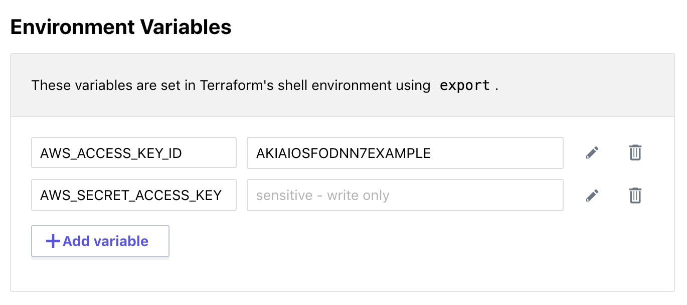
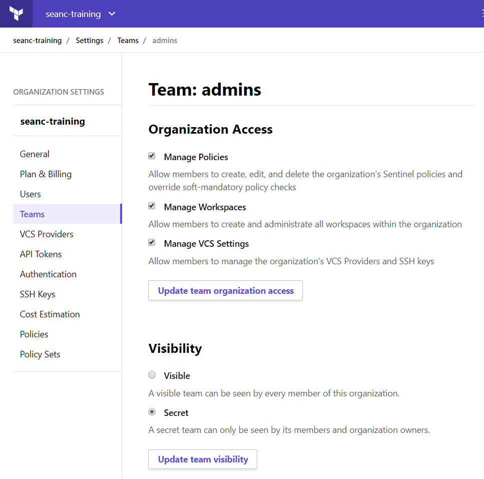

name: TFE-Chapter-7
class: title
# Chapter 7
## Security and Role-Based Access Controls

???
**Welcome back, you made it through Chapter 6. Next we're going to look at secure variables and role based access controls or RBACs.**

---
name: securing-sensitive-vars
class: title, smokescreen, shelf
background-image: url(images/ch07/secure_lock.jpg)
# Sensitive Variables
## A Secure Place for API Credentials

???
**First let's talk about sensitive variables, specifically API keys. Every time you build infrastructure on AWS you need an access key pair. The key pair includes the Access Key Id, and the Secret Access Key. These two strings paired together, with an optional time-based token, allow you to make requests to AWS API endpoints. Amazon spins up the resources and begins billing you for usage. These keys, especially if they are created by an account admin, are very powerful. The default setting in AWS is to grant admin-level access to the user. Let's look at how this can be a major problem...**

---
name: Security-and-Compliance
# Did you know?
Thousands of API and cryptographic keys are leaked to GitHub every day!

https://nakedsecurity.sophos.com/2019/03/25/thousands-of-coders-are-leaving-their-crown-jewels-exposed-on-github/

>"I think efforts like GitHub’s Token Scanning project should be applauded, but they are only effective once a leak has already occurred. This problem also is likely not isolated to GitHub – it will affect any publicly available code. We need more research to develop systems that help developers avoid this mistake in the first place."

???
**This is from a recent article about a study Sophos did on credentials stored on GitHub. They used a free API key and simple search algorithm to crawl through github and what they found was very disturbing. Hundreds of thousands of API keys, passwords and other sensitive strings were found.**

**If you've never seen it in action this is what usually happens. The attacker takes control of your AWS account and begins spinning up an enormous cryptocurrency farm with the maximum number of instances allowed. Then you have to get AWS support to help you untangle the mess. It's not fun. You really, really want to protect those API keys.**

---
name: Protecting-Sensitive-Variables
class: img-right-full
# Protecting Sensitive Variables

* Cloud API Keys
* Passwords
* SSH private keys
* SSL certificates
* Any sensitive text or data

???
**Terraform Cloud has built in support for encryption and storage of any short string of text. This allows you to safely use these credentials during the provisioning process without exposing them in plaintext or storing them on someone's laptop.**

---
name: where-are-your-creds
# Where Are Your API Keys?
Terraform requires credentials in order to communicate with your cloud provider's API.

These API keys should **never** be stored directly in your terraform code.

Config files and environment variables are a better option, but the credentials still live on your workstation, usually stored in plaintext.

???
**In case we weren't clear earlier, do not ever store credentials in your terraform code. Don't do it.**

---
name: a-better-way-creds
# A Better Way to Store Sensitive Data

Terraform Cloud can safely store your credentials and encrypt them for you. You can use this encrypted storage for passwords, TLS Certificates, SSH keys or anything else that should not be lying around in plain text.

.center[]

???
**Here's an example of storing AWS credentials safely so that we can use them inside of a workspace. The user doesn't have to manage these once they are set.**

---
name: terraform-teams
class: title, smokescreen, shelf
background-image: url(images/ch07/teamwork.png)
# Terraform Cloud Teams
## Role-Based Access Controls (RBAC)

???
**This section is about teams and role based access controls.**

---
name: terraform-rbac-2
class: img-right
# Teams for Terraform Collaboration

Teams are used to grant different levels of access to different parts of your Terraform infrastructure, depending on the user's role.

Workspaces access levels include read, plan, write, and admin. Super users can also be granted organization wide permissions for managing policies and VCS settings.

???
**You'll probably start out with a few admins, but as your terraform usage grows more and more users and applications will need different levels of access.**

---
name: lab-exercise-2
# 👩‍💻 Lab Exercise: Secure Variables and RBACs
  
In this lab you'll learn how to store and encrypt sensitive variables and set up role-based access controls (RBACs).

Continue the lab exercises from where you left off.

🛑 **STOP** after you complete the second quiz.

???
**And that brings us to the second lab, where you'll tackle the Secure Variables and RBAC challenges. Once you've made it past the second quiz you can take a break until Chapter 3.**
