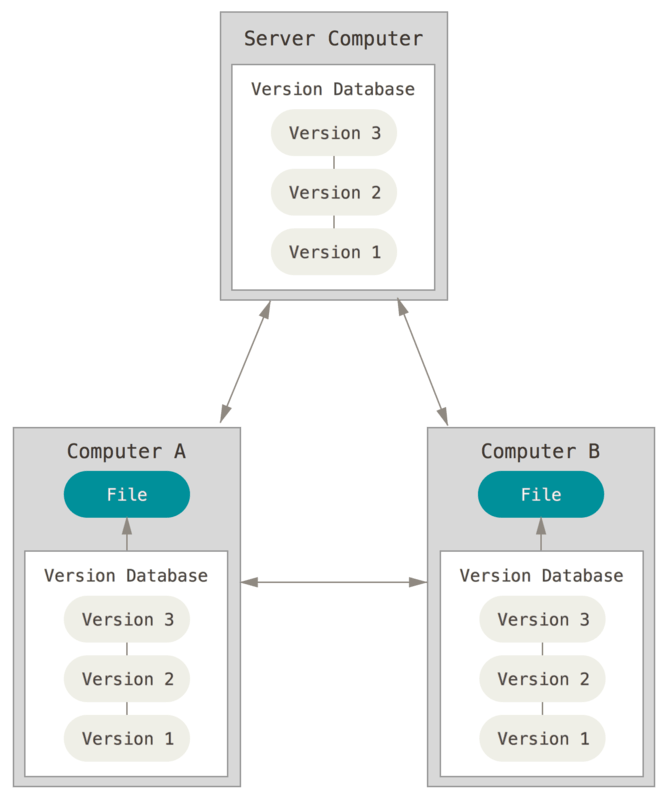

name: TFE-Chapter-8
class: title

# Chapter 8
## Version Control and Sentinel Policies

???
**Now we're getting into slightly more advanced territory. It is also very cool territory because you can start to drive automation with code. We're going to cover VCS integration and Sentinel policies. The reason we cover VCS before Sentinel is because you'll want to define all your policy as code too!**

---
name: version-control-title
class: title, smokescreen, shelf
background-image: url(images/ch08/git_log.png)
# Terraform With VCS
## Version Control Systems

???
**Version control systems have been around for at least a few decades. Can anyone name a few?**

Common answers might be RCS, SVN (Subversion).

**And what's the world's most popular distributed version control system? That's right, it's git. Git was invented by Linus Torvalds, the same gent who created Linux.**

---
name: whats-a-vcs
class: img-right
# What is a Version Control System (VCS)?



Version control systems are applications that allow users to store, track, test, and collaborate on changes to their infrastructure and applications.

Terraform Cloud integrates with most common Version Control Systems.

???
**Make sure you don't confuse git (the version control system) with GitHub (a web-based application containing the world's largest collection of git repositories). What are some other flavors of git? Bitbucket, GitLab are both also supported in Terraform Cloud. Today you'll be working with GitHub but you can integrate with any of the major git vendor software.**

---
name: tfc-infra-as-code-workflow
class: img-left
# VCS Integration with Terraform Cloud


Terraform Cloud can directly integrate with source code repos in GitHub Enteprise, Gitlab, and Bitbucket. This allows you to build simple DevOps workflows with code reviews, testing and approvals.

https://xkcd.com/1597/

For this workshop you'll only need four or five git commands.

???
**If you've never used git before, don't worry. We are only going to be using four or five basic commands. And as our friends at XKCD have pointed out, you can always wipe everything clean and clone a fresh copy of the code.**

---
name: multi-user-collaboration
class: img-right-full
# User Collaboration

Users from different teams or departments can all benefit from centralized infrastructure as code.

Infrastructure changes are no longer created in isolated silos.

Each team can contribute or consume Terraform code according to their needs.

.small[http://www.commitstrip.com/en/2015/02/02/is-your-company-ready-for-devops/]

???
**When you store all your terraform code in git repos, you unlock some extra features like user collaboration. This is a funny comic called CommitStrip where dev and ops try to learn to work together. Terraform Cloud helps bring these teams closer in a more productive way.**

---
name: vcs-driven-workflow
# Automated Test Pipelines
.center[]

When your Terraform code is stored in a version control system, you unlock extra features like pull requests, code reviews and testing. Here's an example showing some tests that run on our training lab repo.

???
**Storing your code in VCS also enables you to build automated test pipelines and conduct code reviews to approve any pending changes. Multiple users can build and contribute changes to the same infrastructure as code base without stepping on one anothers toes.**

---
name: everything-is-recorded
# No More Untracked Changes
.center[]

Every infrastructure change is recorded and tracked in the git log. You will always know exactly who made a change, what was changed, who approved the change, and when and why the change was made.

???
**Your auditors and security folks will like this because every change is tracked. No more mystery changes or wondering if something broke because of an untracked change.**

---
name: sentinel-policy-enforcement
class: title, smokescreen, shelf
background-image: url(images/ch08/security_lasers.jpg)
# Sentinel
## Policy Enforcement for Terraform

???
**Sentinel is the HashiCorp policy enforcement language and it is only available in terraform cloud or enterprise.**

---
name: what-is-sentinel
# What is Sentinel?
```hcl
# Restricting region in AWS
aws_region_valid = rule {
  all region_values as rv {
	rv == "us-east-1"
  }
}
```

Sentinel is HashiCorp's policy enforcement language. Sentinel policies are checked after **`terraform plan`** is run. Sentinel will intercept bad configurations *before* they go to production, not after.

???
**As the saying goes, an ounce of prevention is worth a pound of cure. Sentinel helps you catch misconfigurations and bad behavior before the infrastructure is deployed, not after.**

---
name: what-can-sentinel-do
# Example Uses for Sentinel
* Enforce owner allow list on aws_ami data source
* Enforce mandatory tags on instances
* Restrict availability zones
* Disallow 0.0.0.0/0 CIDR blocks
* Restrict instance types of EC2 instances
* Require VPCs to be tagged and have DNS hostnames enabled

You can implement these rules and many more using Sentinel.

???
**Sentinel is flexible and can be used to detect almost any kind of compliance or security violation.**

---
name: sentinel-enforcement-levels
# Sentinel Enforcement Levels
⏰ **Advisory** - Issues a warning to the user when they trigger a plan that violates the policy.

⚠️ **Soft-Mandatory** - Blocks regular users from deploying the non-compliant infrastructure. Only admins can override.

🛑 **Hard-Mandatory** - Blocks all users and apps from deploying the non-compliant infrastructure.

???
**There are three enforcement levels. You might start with everything set to Advisory to give your users a warning. Then you could set a date to start enforcing soft and hard mandatory rules for some or all workspaces in your organization.**

---
name: org-or-workspace
# Apply to Organization or Workspaces
.center[]

???
**You can be very specific or very broad with your policy enforcement. Organization-wide policies can be implemented to ensure that basic security rules are always followed everywhere.**

---
name: lab-exercise-3
# 👩‍💻 Lab Exercise: Version Control and Sentinel
<br><br>
In this lab we'll cover Version Control System (VCS) integration and Sentinel Policy Enforcement.

Continue the lab exercises from where you left off.

🛑 **STOP** after you complete the third quiz.

???
**This lab is a bit more challenging so take your time and read the notes carefully. I will be around along with your TA to answer questions if you get stuck. Stop after the third quiz.**
