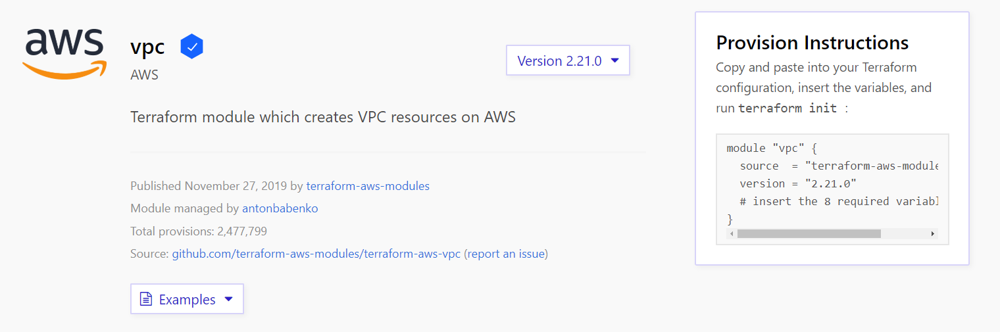
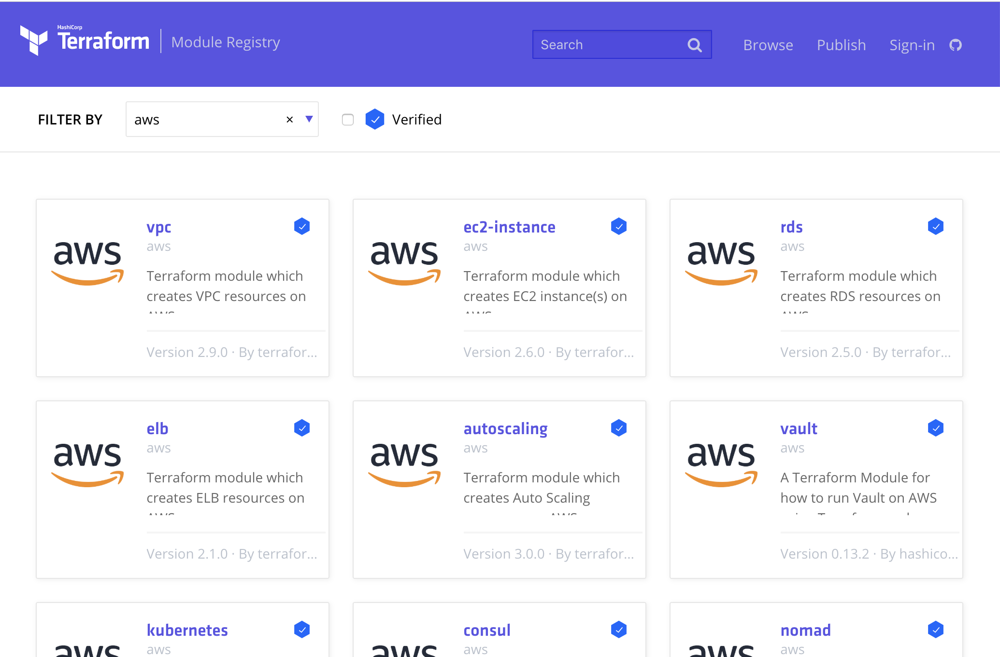

name: TFE-Chapter-4
class: title
# Chapter 9
## Modules and API Automation

???
**This is the final content chapter where we'll cover the private module registry and API automation.**

---
name: private-module-registry
class: title, smokescreen, shelf
background-image: url(images/ch09/lego_wallpaper.jpg)
# Terraform Modules
## Reusable Infrastructure as Code

???
**First let's take a look at modules. Modules are fun, like these LEGO bricks.**

---
name: what-even-is-module
# What is a Terraform Module?
.center[]

Modules are reusable units of Terraform code that hide unnecessary complexity from the user. This one creates a standard VPC configuration with only 8 variables.

???
**You'll get to use this module in the lab. If you've ever built out a VPC by hand you know that it's not a super simple process. You need to configure the correct network routes, set up your subnets, internet gateways and a bunch of other settings to get it right. This VPC module is meant to give you a standard set of inputs that you can use to configure a best-practice VPC with public and/or private subnets. This saves you the trouble of having to go write all that terraform code yourself.**

---
name: how-modules-configured
# How are Terraform Modules Configured?
Creating Terraform Modules in 3 easy steps:

1. Write some Terraform code, configuring inputs and outputs.
2. Store the Terraform code somewhere your workstation can access it.
3. Reference your modules by file path or source URL.

Sounds easy right?

What if you had to manage dozens or hundreds of modules, with different versions of each?

???
**Think of a terraform module like a black box. Variables (inputs) go in one side, and outputs come out the other side. What happens in the middle is really none of the user's business, as long as they get what they wanted from the module. This lets you control what users are able to build, and guide them to the right path by putting guard rails around them. You can hide variables and settings that the user should not tinker with, and this also keeps things simpler for the end user who just wants their VPC to work so they can build some instances.**

**The challenge is when you start having dozens or hundreds of modules and lots of users consuming them...you really need a centralized way to manage this stuff, which brings us to...**

---
name: private-module-registry
class: img-right
# Private Module Registry


Terraform modules are reusable packages of Terraform code that you can use to build your infrastructure.

Terraform Cloud includes a Private Module Registry where you can store, version, and distribute modules to your organizations and teams.

???
**This is just like the public module registry but it runs inside your own Terraform Organization where only your users can access it. This way you can share private or confidential code, or even take the public modules and fork them for your own use.**

---
name: api-driven-workflows
class: title, smokescreen, shelf
background-image: url(images/ch09/enter_the_matrix.jpg)
# Terraform Cloud API
## Automate Everything

???
**This section will give us a small sample of what's possible using the Terraform Cloud API to build automation. APIs provide a clear and well understood method for interacting with Terraform Cloud, even from systems that have no native Terraform support or integrations.**

---
name: whats-an-api
# Application Programming Interface
```ruby
curl -s -H "Accept: application/json" https://icanhazdadjoke.com

{
  "id": "jyPCYTKuskb",
  "joke": "How did Darth Vader know what Luke was getting for
           Christmas? He felt his presents.",
  "status": 200
}
```
APIs are the default language of the Internet. According to Akamai research 83% of Internet traffic is made up of API calls (JSON/XML).
.center[.small[https://www.akamai.com/us/en/about/news/press/2019-press/state-of-the-internet-security-retail-attacks-and-api-traffic.jsp]]

???
**There are APIs for all kinds of stuff! Even Dad Jokes!**

---
name: terraform-cloud-api
# Terraform Cloud API - How It Works
```bash
# Create a workspace using the API
curl --header "Authorization: Bearer $TOKEN" --header \
"Content-Type: application/vnd.api+json" --request POST \
--data @/tmp/create_workspace.json \
https://app.terraform.io/api/v2/organizations/$ORG/workspaces
```

1. Applications and tools authenticate to the API with a token.
2. JSON payloads determine which knobs and buttons to push.
3. The JSON payloads are submitted to different API endpoints depending on what you're doing.

Most programming languages have helper libraries for working with APIs.

???
**During the lab we'll be using the Unix cURL command. Curl is like a swiss army knife for talking to APIs and websites.**

---
name: api-use-cases
# Terraform Cloud API - Use Cases

* Continuous Integration test pipelines
* Connect with workflow managment systems
* External systems that need to query Terraform state for data
* Self-service portal with Terraform on the backend
* Custom command line scripts for specific needs

???
**Here are just a few of the things you might build with the Terraform Cloud API.**

---
name: lab-exercise-4
# 👩‍💻 Lab Exercise: Modules and API Automation
<br><br>
In this lab we'll cover the Private Module Registry and API Automation with Terraform Cloud.

Continue the lab exercises from where you left off.

🛑 **STOP** after you complete the fourth quiz.

???
This is the last official lab; the bonus lab will be stored in a separate track.
