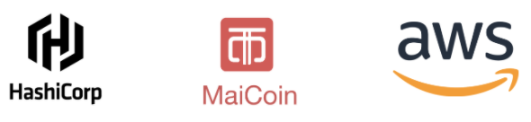

name: Mastering Infrastructure as Code Workshop
class: center

  
# Mastering Infrastructure as Code Workshop
### Build AWS Resources with Infrastructure as Code

---
name: Link-to-Slide-Deck
# The Slide Deck
   
Follow along on your own computer at this link:

### <https://git.io/JfQrY>

---
name: Introduction
class: img-right-full

# Hello!
## I am smalltown
  - MaiCoin Lead Site Reliability Engineering
  - Taipei HashiCorp User Group Organizer
  - AWS User Group Taiwan Staff
   

???
介紹自己，提一些關於自己的背景故事，走一遍教室，讓學員介紹他們自己

問問他們最喜歡的文字編輯器是什麼，並且試著了解他們的技術水平

 **帶到課程中使用到的是 VS Code，他對於 Terraform 的支援性很好，練習中過程大部分都有程式碼可以參考，所以對於 IaC 領域一竅不通的人也不用感到害怕，Terraform 是很容易學會的，大家放鬆心情愉快地參加今天的課程即可
**

---
name: IaC Day 1
# IaC Day 1

1. Intro to Terraform 
2. Terraform Basics 
👩‍🔬 **Lab - Setup and Basic Usage** 
3. Terraform In Action 
🧪 **Lab - Terraform in Action** 
4. Provision and Configure AWS Instances 
🔬 **Lab - Provisioning with Terraform** 
5. Manage and Change Infrastructure State 

???
今天整個 Workshop 會花六個小時左右

**底下是今天的上課內容，每一個主題都會有投影片來講解，有些主題有讓大家實際動手做的 Lab，然後再課程的進行中會穿插一些休息時間**

---
name: IaC Day 2
class: col-2
# IaC Day 2

1. OSS to Cloud/Enterprise 
🌥️ Terraform Cloud Overview 
👨🏽‍🏫 Review the Basics 
🔗 Configure Remote State 

2. Security and RBACs 
🔐 Protect Sensitive Variables 
🛡️ Work With Access Controls 

3. VCS & Policy Enforcement 
🕸️ Connect to VCS 
👬 Collaboration with VCS 
👮 Sentinel Policy Enforcement 

4. Terraform Modules & API 
⚙️ Private Module Registry 
🏗️ API Driven Workflows 

5. Extra Resources 
⚗️ Bonus Lab 
🌐 Useful Links

???
**而今天的課程會分成兩個大的部分，分別是 IaC Day 1 跟 IaC Day 2，Day 1 的內容涵蓋剛學習 Terraform 時需要注意的地方；而 Day 2 的內容則是聚焦在如何解決當整個團隊要一起使用 Terraform 來協作開發時會遇到的問題
**
